# System Setup for Linux (Ubuntu & Debian)

1. Click on the Ubuntu icon in the top left to open the Dash, type in "Terminal" and click on the matching application.<br><br>
   <br>
2. Copy each line in the following text, paste it in the terminal and hit return.<br><br>
   ```bash
   curl -fsSL https://deb.nodesource.com/setup_18.x | sudo -E bash -
   sudo apt-get update
   sudo apt-get install -y git nodejs
   sudo npm install --global yarn
   ```
   This uses apt to install Git and Node.js and npm to install Yarn.<br><br>
3. For the version matching your version of Ubuntu, copy each line in the following text, paste it in the terminal and hit return.<br>

   **Ubuntu 18.04 (Bionic)**<br><br>

   ```bash
   curl -sSL https://packages.microsoft.com/keys/microsoft.asc | sudo apt-key add -
   sudo apt-add-repository https://packages.microsoft.com/ubuntu/18.04/prod
   sudo apt-get update
   sudo apt-get install gcmcore
   git-credential-manager-core configure
   ```

   **Ubuntu 21.04 (Hirsute)**<br><br>

   ```bash
   curl -sSL https://packages.microsoft.com/config/ubuntu/21.04/prod.list | sudo tee /etc/apt/sources.list.d/microsoft-prod.list
   curl -sSL https://packages.microsoft.com/keys/microsoft.asc | sudo tee /etc/apt/trusted.gpg.d/microsoft.asc
   sudo apt-get update
   sudo apt-get install gcmcore
   git-credential-manager-core configure
   ```

   **Other Ubuntu/Debian versions**

   Download [the latest `.deb` package](https://github.com/microsoft/Git-Credential-Manager-Core/releases/latest) (the one called something like `gcmcore-linux_amd64.x.x.xxx.xxxxx.deb`) and then run the following commands:

   ```bash
   sudo dpkg -i <path-to-package>
   git-credential-manager-core configure
   ```

   This installs Git Credential Manager Core.<br><br>

4. Copy the following text, paste it in the terminal and hit return.<br><br>
   ```bash
   sudo snap install code --classic
   sudo snap install flyctl --edge
   ```
   This uses Snap to install VS Code and `flyctl`.<br><br>
5. <a name="vs-code-extensions"></a> Copy each line in the following text, paste it in the terminal and hit return.<br><br>

   ```bash
   code --install-extension Cardinal90.multi-cursor-case-preserve
   code --install-extension dbaeumer.vscode-eslint
   code --install-extension dozerg.tsimportsorter
   code --install-extension esbenp.prettier-vscode
   code --install-extension frigus02.vscode-sql-tagged-template-literals-syntax-only
   code --install-extension styled-components.vscode-styled-components
   code --install-extension kumar-harsh.graphql-for-vscode
   code --install-extension meganrogge.template-string-converter
   code --install-extension stylelint.vscode-stylelint
   code --install-extension sysoev.vscode-open-in-github
   code --install-extension mattpocock.ts-error-translator
   code --install-extension wix.glean
   ```

   This installs some VS Code extensions we will need.<br><br>

6. If you don't have Zoom yet, install it: with each line below, copy the text, paste it in the terminal and hit return.<br><br>
   ```bash
   cd /tmp
   wget https://zoom.us/client/latest/zoom_amd64.deb
   sudo dpkg --install zoom_amd64.deb
   cd -
   ```
   This installs Zoom.<br><br>
7. If you don't have Slack yet, install it: copy the following text, paste it in the terminal and hit return.<br><br>
   ```bash
   sudo snap install slack --classic
   ```
   This uses Snap to install Slack.<br><br>
8. Copy the following text, paste it in the terminal and hit return.<br><br>
   ```bash
   sudo snap install postman
   ```
   This uses Snap to install Postman.<br><br>
9. We recommend installing and using Chrome so that you have the same DevTools as others.<br><br>
   If you don't have Chrome installed yet, you can install it by copying each line below, pasting it in the terminal and hitting return.<br><br>
   ```bash
   cd /tmp
   wget https://dl.google.com/linux/direct/google-chrome-stable_current_amd64.deb
   sudo dpkg --install google-chrome-stable_current_amd64.deb
   cd -
   ```
   This installs Chrome.<br><br>
10. Install the following Chrome Extensions:
    - [React Developer tools Chrome Extension](https://chrome.google.com/webstore/detail/react-developer-tools/fmkadmapgofadopljbjfkapdkoienihi?hl=en)
    - [Refined GitHub Chrome Extension](https://chrome.google.com/webstore/detail/refined-github/hlepfoohegkhhmjieoechaddaejaokhf?hl=en)
    - [Web Vitals Chrome Extension](https://chrome.google.com/webstore/detail/web-vitals/ahfhijdlegdabablpippeagghigmibma?hl=en)
11. Copy the following text, paste it in the terminal and hit return.<br><br>

    ```bash
    yarn create react-app --help
    ```

    This will prepare a program that we will use in the course. This will take a while and then respond with a message that some modules have been installed, similar to this:<br><br>
    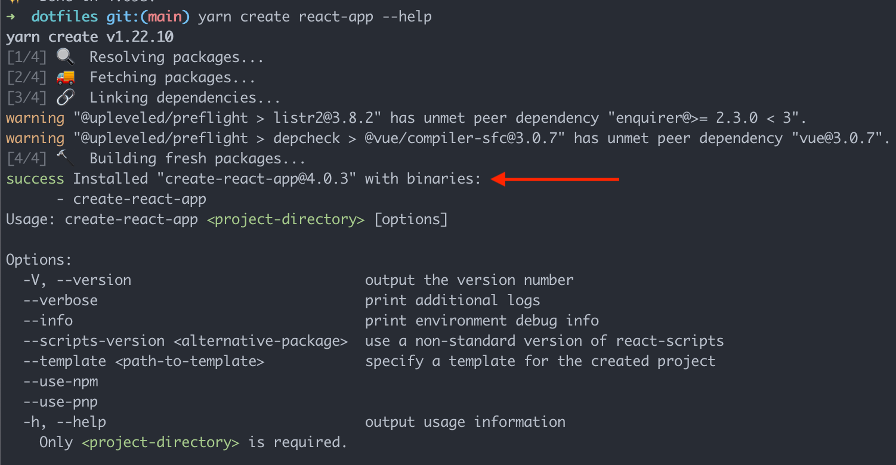<br><br>

12. Copy the following text, paste it in the terminal and hit return.<br><br>
    ```bash
    sudo yarn global add @upleveled/preflight
    ```
    This will prepare a program that we will use in the course.<br><br>
13. <a name="vs-code-settings"></a> Next we will configure VS Code.<br><br>
    Open VS Code and then press the keys <kbd>Ctrl</kbd>-<kbd>Shift</kbd>-<kbd>P</kbd>. Type in "Settings" and select the item that says `Preferences: Open Settings (JSON)`:<br><br>
    <br><br>
    Once the settings file is open, we will want to add the settings below.<br><br>
    First of all, identify whether your settings file is empty or not. This is what an empty file looks like:<br><br>
    <br><br>
    If your file is **not empty** (if there is more text within the curly brackets), then **we will need to do something extra** - add a comma on the second to last line:<br><br>
    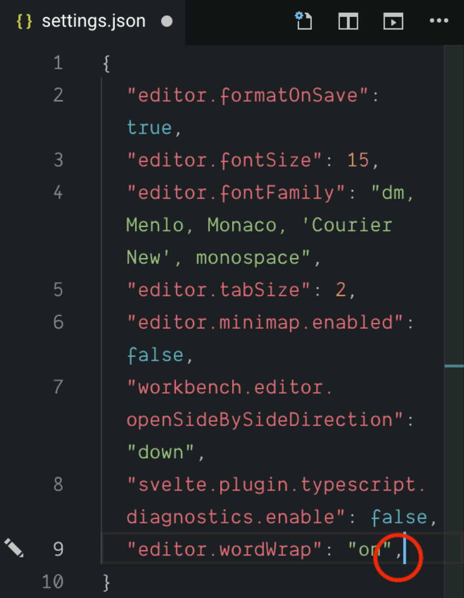<br><br>
    Now in both cases you will want to paste the following settings **before the closing curly bracket (before the `}`)**:<br><br>
    ```json5
    "editor.wordWrap": "on",
    "editor.minimap.enabled": false,
    "editor.formatOnSave": true,
    "tsImportSorter.configuration.groupRules": ["^node:", {}, "^[.]"],
    "tsImportSorter.configuration.keepUnused": [".*"],
    "tsImportSorter.configuration.emptyLinesBetweenGroups": 0,
    "tsImportSorter.configuration.wrappingStyle": "prettier",
    "editor.defaultFormatter": "esbenp.prettier-vscode",
    "[html]": {
      "editor.defaultFormatter": "esbenp.prettier-vscode"
    },
    "[javascript]": {
      "editor.defaultFormatter": "esbenp.prettier-vscode"
    },
    "[javascriptreact]": {
      "editor.defaultFormatter": "esbenp.prettier-vscode"
    },
    "[typescript]": {
      "editor.defaultFormatter": "esbenp.prettier-vscode"
    },
    "[typescriptreact]": {
      "editor.defaultFormatter": "esbenp.prettier-vscode"
    },
    "[json]": {
      "editor.defaultFormatter": "esbenp.prettier-vscode"
    },
    "[jsonc]": {
      "editor.defaultFormatter": "esbenp.prettier-vscode"
    },
    "files.autoSave": "onFocusChange",
    "explorer.openEditors.visible": 0,
    "editor.tabSize": 2,
    "files.insertFinalNewline": true,
    "files.trimFinalNewlines": true,
    "files.trimTrailingWhitespace": true,
    "[markdown]": {
      "files.trimTrailingWhitespace": false
    },
    "workbench.editor.tabSizing": "shrink",
    "workbench.editor.closeEmptyGroups": false,
    "prettier.singleQuote": true,
    "prettier.trailingComma": "all",
    "eslint.runtime": "node",
    ```
    If you had any previous settings beforehand, you may notice that some text above will be underlined by a squiggly yellow line. This is a warning because we pasted some duplicate properties from the code above.<br><br>
    If you have any of these warnings, we should fix them. For each one of these lines with the warnings on them, delete the full line, including the comma at the end. We usually like to select from the start of the first `"` to just before the next `"` on the next line:<br><br>
    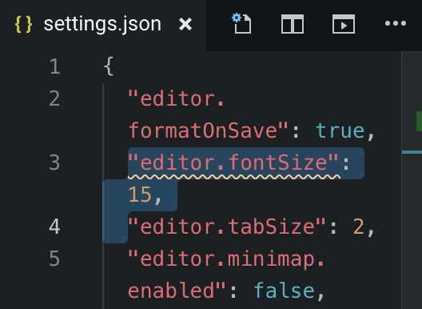<br><br>
14. <a name="postgresql"></a>We will now install PostgreSQL. Copy and run each of these lines separately in the terminal:<br>

    ```bash
    sudo sh -c 'echo "deb http://apt.postgresql.org/pub/repos/apt $(lsb_release -cs)-pgdg main" > /etc/apt/sources.list.d/pgdg.list'
    wget --quiet -O - https://www.postgresql.org/media/keys/ACCC4CF8.asc | sudo apt-key add -
    sudo apt update
    sudo apt install postgresql-15
    ```

    This will install PostgreSQL and create a default user of `postgres` with no password (only authorized users can use this user).<br><br>

    Your database will be started automatically - no need to start it manually.

    Now we will connect to PostgreSQL using a tool called `psql` and add a new table, to make sure everything is working with the connection.

    Run the following command:

    ```bash
    sudo -u postgres psql
    ```

    It should look like this:<br><br>

    <br><br>

    If your screen looks like the above screenshot, type in or copy and paste the following query (this is a language called SQL):

    ```sql
    CREATE TABLE users(
      id serial PRIMARY KEY,
      first_name VARCHAR (100) NOT NULL,
      last_name VARCHAR (100) NOT NULL
    );
    ```

    It should print `CREATE TABLE` on the line after running the query. Your screen should look like this:<br><br>

    <br><br>

    Now let's check that the table has been created. Run this query:

    ```
    \dt
    ```

    This will show the tables that you have, including the newly-created `users` table. Your screen should look like this:<br><br>

    <br><br>

    Finally, let's delete the table again to clean up. Run this query:

    ```sql
    DROP TABLE users;
    ```

    It should print `DROP TABLE` on the line after running the query. Your screen should look like this:<br><br>

    <br><br>

    Great, PostgreSQL is set up! 🚀 Now you can exit from `psql` again by writing `exit` and hitting return:

    ```
    exit
    ```

    It should exit and send you back to the command line. Your screen should look similar to this (the last line will not be exactly the same):<br><br>

    <br><br>

15. <a name="docker"></a>Copy the following text, paste it in the terminal and hit return.<br><br>

    ```bash
    sudo snap install docker
    ```

    This uses Snap to install Docker.<br><br>

16. Test if Docker is installed by running the following command on the command line:

    ```bash
    docker run hello-world
    ```

    It should print out a welcome message like this:<br><br>
    <br><br>

17. <a name="expo-react-native"></a>We will now install Expo CLI for React Native.

    Copy the following text, paste it in the terminal and hit return.

    ```bash
    sudo npm install -g expo-cli
    ```

    You can ignore the lines marked `WARN` - these do not indicate problems:<br><br>

    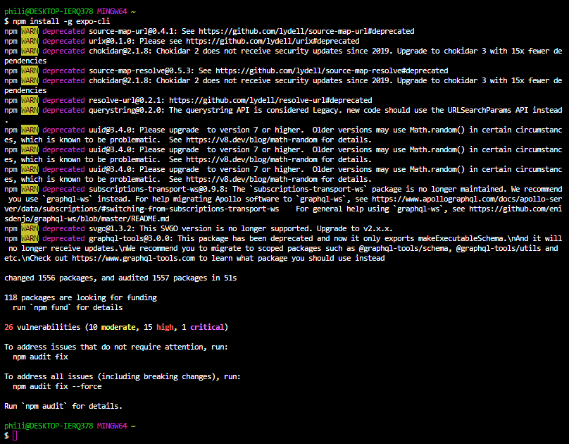<br><br>

    Lastly, we'll install Expo on your phone, so that you can also test on a real device.

    On your phone, go to the app store and install Expo on your phone ([Android](https://play.google.com/store/apps/details?id=host.exp.exponent&hl=en&gl=US), [iOS](https://apps.apple.com/us/app/expo-go/id982107779)). Create an account and log in.

18. Next we will set up some dependencies for Expo and React Native.

    Copy each line in the following text, paste it in the terminal and hit return.

    ```bash
    sudo snap install android-studio --classic
    [ -d "$HOME/Library/Android/sdk" ] && ANDROID_SDK=$HOME/Library/Android/sdk || ANDROID_SDK=$HOME/Android/Sdk
    echo "export ANDROID_SDK=$ANDROID_SDK" >> ~/`[[ $SHELL == *"zsh" ]] && echo '.zshenv' || echo '.bash_profile'`
    source ~/`[[ $SHELL == *"zsh" ]] && echo '.zshenv' || echo '.bash_profile'`
    ```

    This will install Android Studio, for creating and running Android virtual devices in an emulator.

    Open Android Studio using Dash.

    If it asks to import Android Studio Settings, choose **Do not import settings**.

    When prompted, choose a **Custom** install:<br><br>

    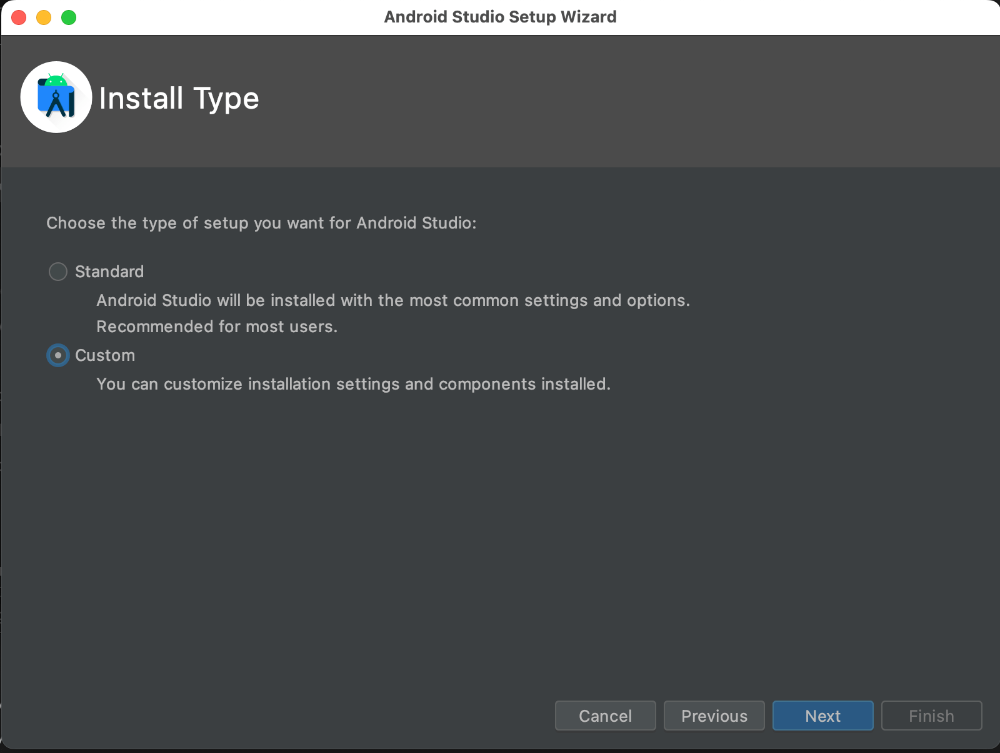<br><br>

    Leave the default JDK installation location as-is and click **Next**:<br><br>

    <br><br>

    Uncheck the box next to **Android Virtual Device** (we will install our own manually):<br><br>

    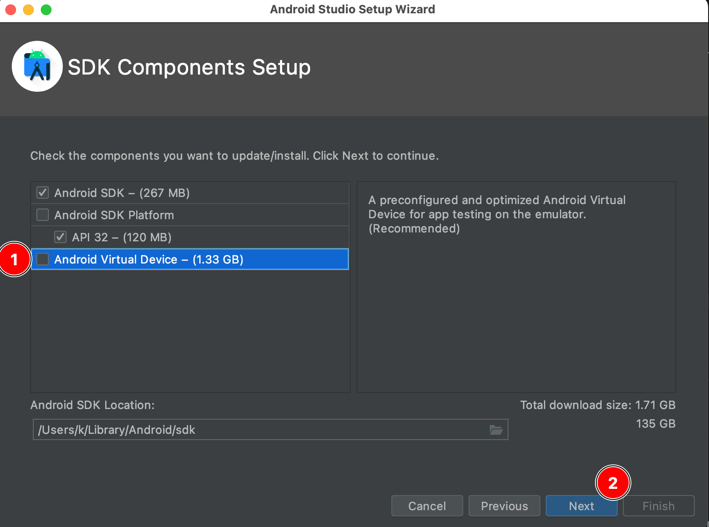<br><br>

    For each of the licenses with red stars next to them, click on the license name and then accept the agreement, finally clicking on **Finish** when you have accepted all agreements:<br><br>

    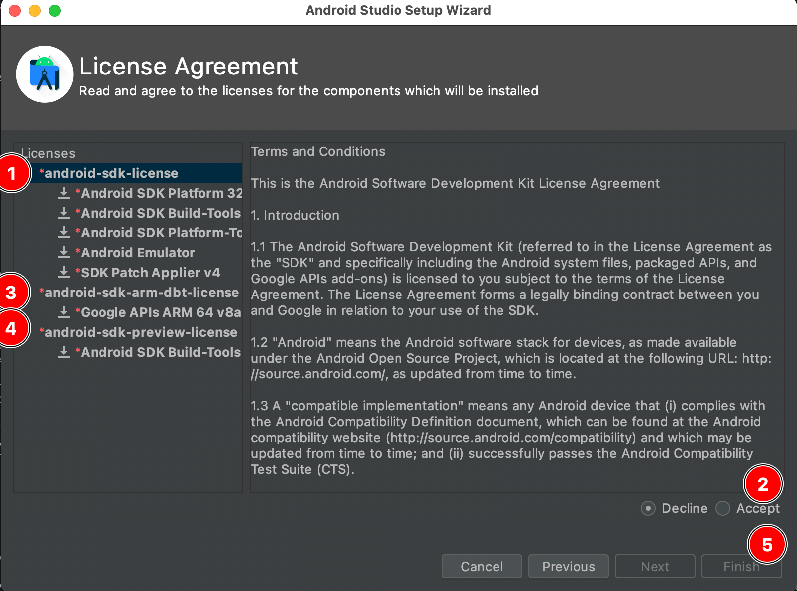<br><br>

    This will download components, which may take a few minutes:<br><br>

    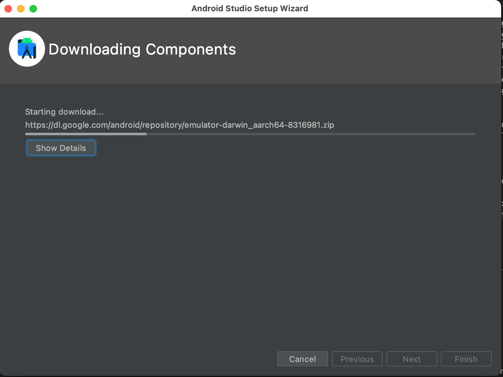<br><br>

    Next will be getting a virtual device installed. Click on **More Actions** and select **Virtual Device Manager**:<br><br>

    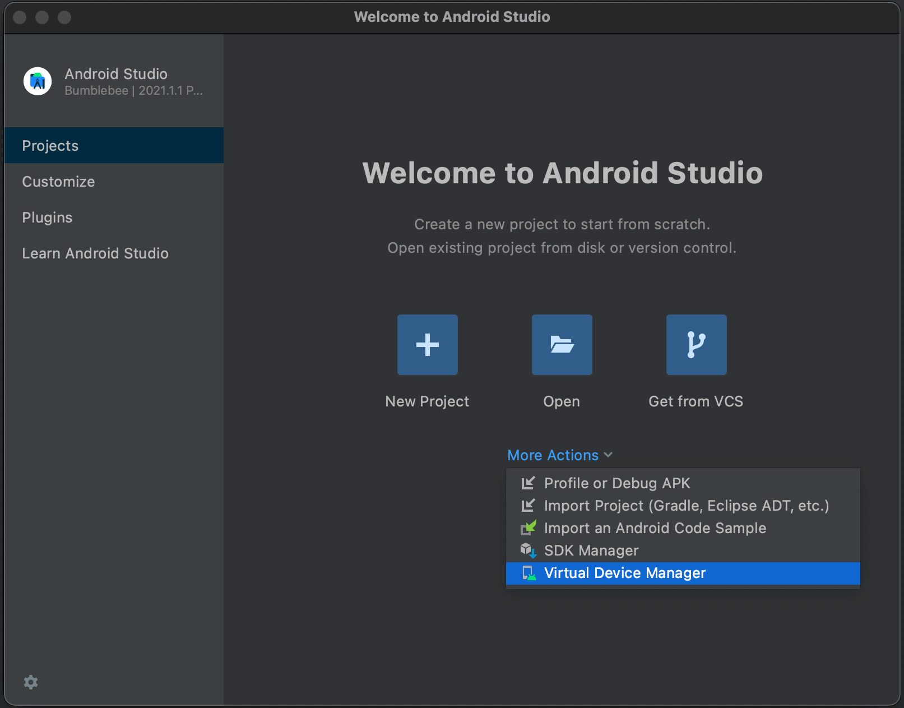<br><br>

    Click on the **Create device** button on the top left of the window:<br><br>

    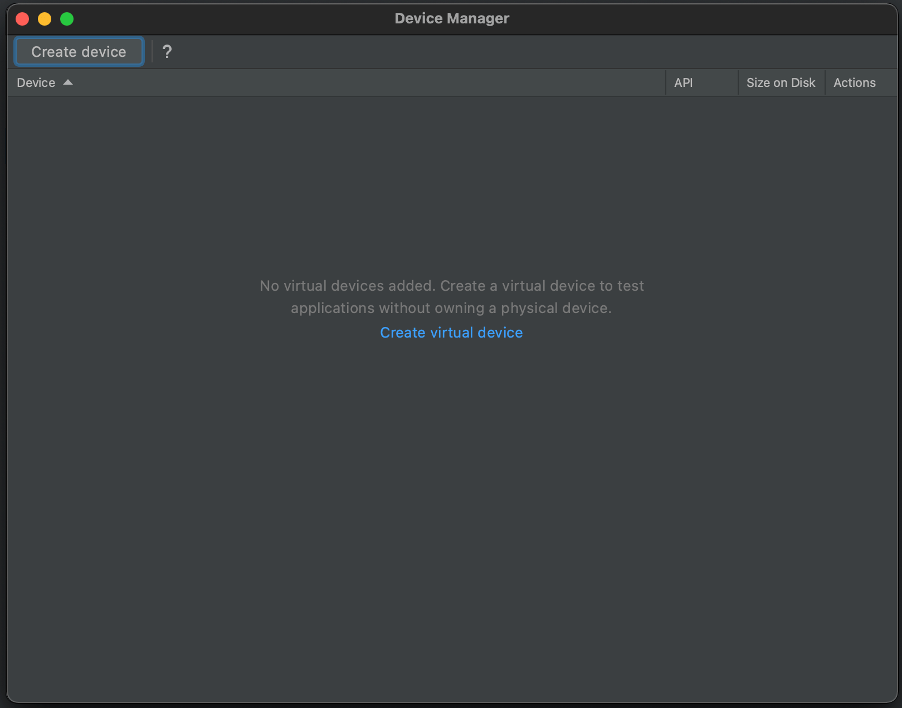<br><br>

    Select the Pixel 3a as the hardware device.

    Under the **Recommended** tab (the default tab), locate the system image named **R** (API level 30) and click on the **Download** link next to it. In the window that pops up, accept the license agreement and click **Next**:<br><br>

    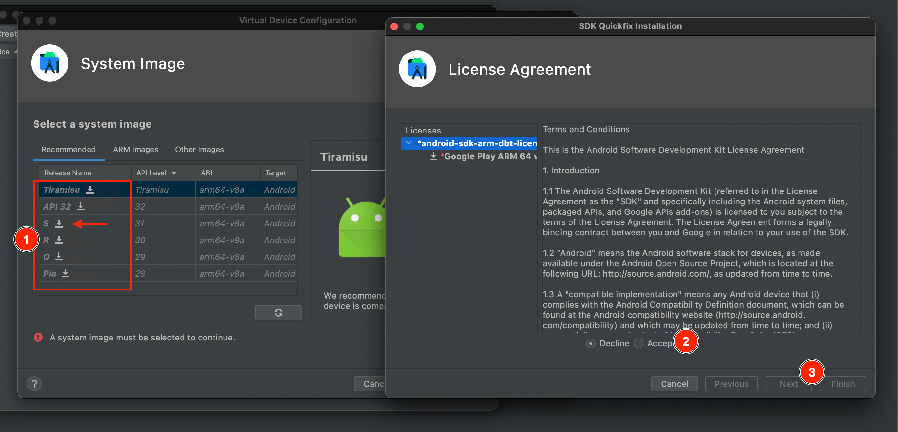<br><br>

    Once the download completes, select the image you just downloaded and click on **Next** through the rest of the steps until the virtual device has been created:<br><br>

    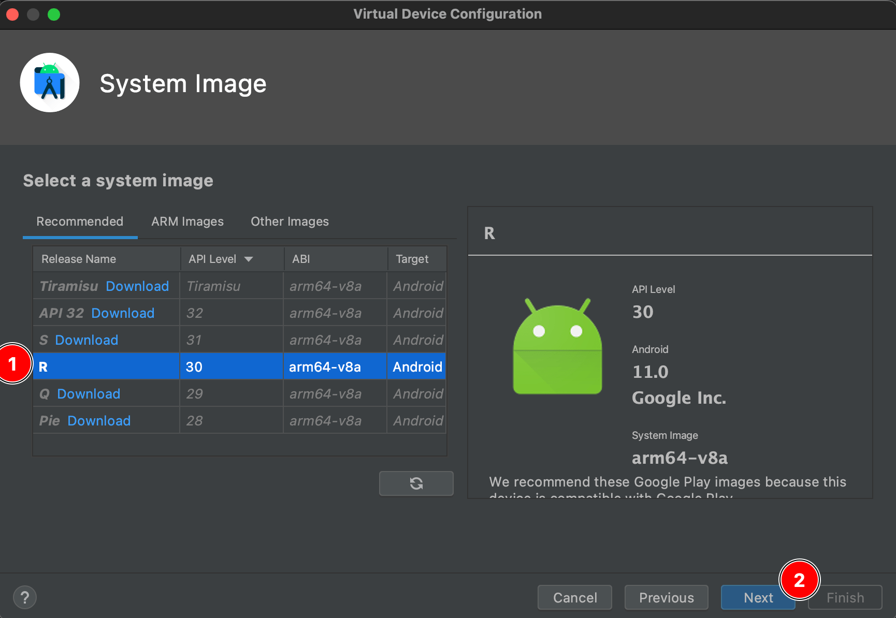<br><br>

    The device will now show up in the Device Manager. Click on the triangular play button to launch the virtual device in the emulator. An emulator window will appear showing the screen of the virtual device:<br><br>

    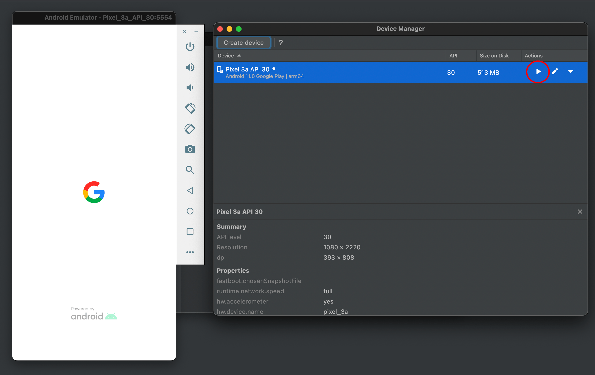<br><br>

    If a message pops up in the virtual device that the "System UI isn't responding" at any point during these steps, you can click on "Wait".

    Before running the first Expo app, test that the Android Studio `adb` (Android Debug Bridge) program has been set up properly, by running the following in a new terminal (open a new tab):

    ```bash
    adb
    ```

    It should print the version and help information:<br><br>

    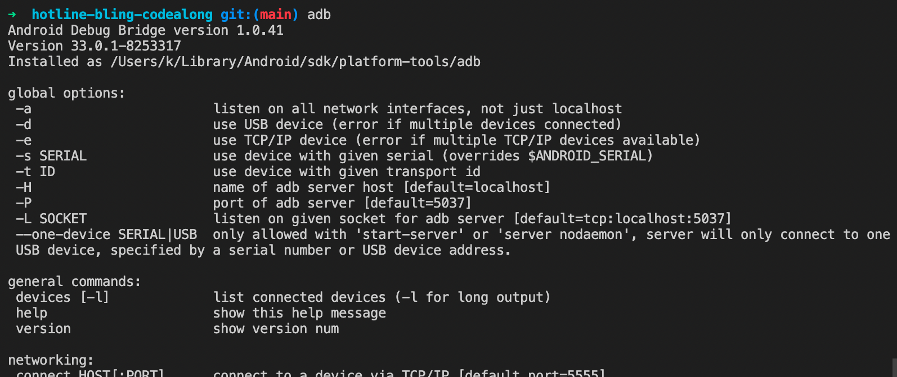<br><br>

19. To verify that Expo is working with the Android Studio virtual device copy and run each of these lines separately in the terminal:

    ```bash
    cd ~
    mkdir -p projects
    cd projects
    yarn create expo-app expo-test --template blank
    cd expo-test
    yarn start --android
    ```

    This will create a new Expo demo app and start it.

    If this step doesn't work, it's possible that you may not have the emulator running - check the last part of the previous step to see how to launch the emulator.

    The first thing that you will see is the installation of Expo Go on the virtual device:<br><br>

    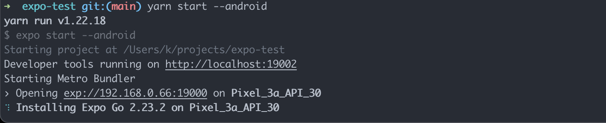<br><br>

    Next, the Metro bundler will bundle the JavaScript for the device, which may take some time. You will see a loading bar in the command line and a loading screen on the virtual device:<br><br>

    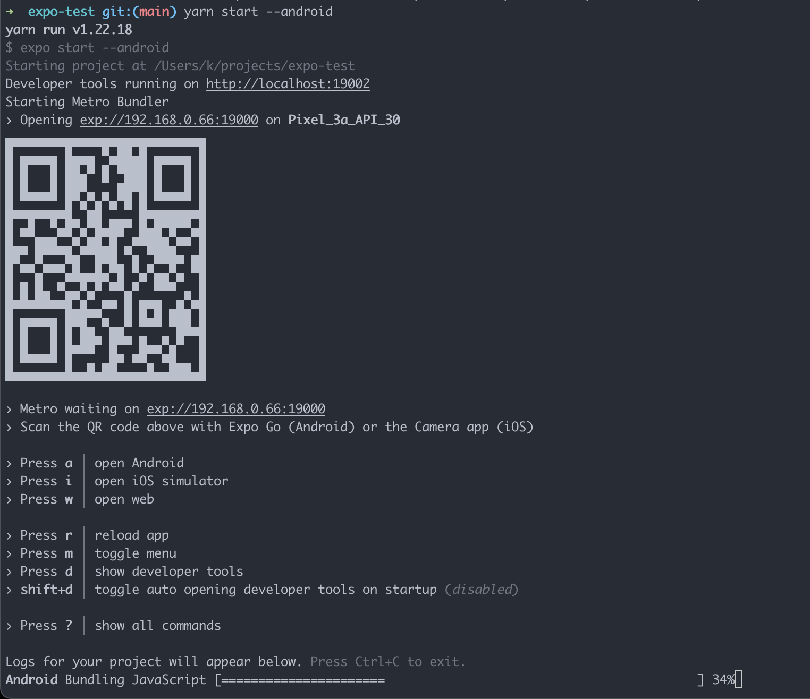<br><br>

    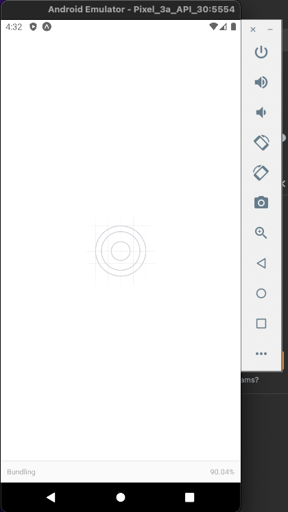<br><br>

    After the bundling has completed, the simple app should show up in the virtual device, with the words "Open up App.js to start working on your app!":<br><br>

    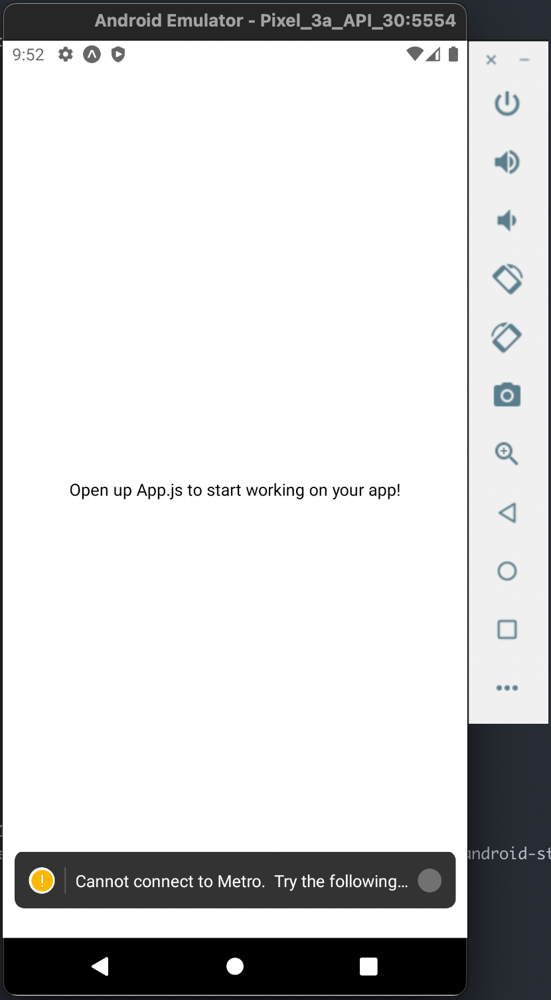<br><br>

    Click on the small `x` at the top right of the virtual device frame to stop the virtual device - this will save a snapshot to make starting the virtual device faster in the future.

20. If you don't have one yet, create a Google account [here](https://accounts.google.com/signup?hl=en). Send the email address associated with this account to Karl (if you haven't already).
21. If you don't have one yet, create a GitHub account [here](https://github.com/join). Make sure to set a name.

    If you already have a GitHub account and you haven't set a name on GitHub yet, go to the [GitHub Profile Settings](https://github.com/settings/profile) and add a name:<br><br>
    <br><br>
    We will use this name in the next step.<br><br>

22. For this step, we'll need to **edit some of the information in the commands** by adding our own information.<br><br>
    First of all, we will set our name, which will be the same name as on our GitHub profile:<br><br>
    <br><br>
    Copy your name from your profile, **add it in quotes** in the command (replace `Mona Lisa Octocat`) and run the command:<br><br>
    ```bash
    git config --global user.name "Mona Lisa Octocat"
    ```
    You can test whether the name was set correctly with the next command (if it worked, it will print the name on the next line):<br><br>
    ```bash
    git config --global user.name
    ```
    <br>For running the next command, **add your email in quotes**:<br><br>
    ```bash
    git config --global user.email "monalisaoctocat@example.com"
    ```
    You can test whether the email was set correctly with with the next command (if it worked, it will print the email on the next line):<br><br>
    ```bash
    git config --global user.email
    ```
    This prepares `git` so that your work is attributed correctly to you.<br><br>

<!-- 22. Copy the following text, paste it in the terminal and hit return.<br><br>
    ```bash
    git config --global credential.helper cache
    ```
    This step will save your GitHub password for 15 minutes so that you don't need to enter it every time.<br><br> -->

23. Copy the following text, paste it in the terminal and hit return.<br><br>
    ```bash
    git config --global init.defaultBranch main
    ```
    This step will change the default Git branch from `master` to `main` (see https://github.com/github/renaming).<br><br>
24. Go back to GitHub, and go to your profile page by clicking on your avatar at the top right and selecting **Your profile**<br><br>
    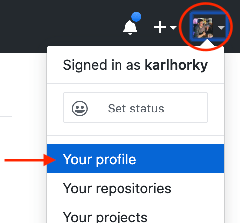<br><br>
    Copy the `github.com/...` URL in the address bar of your browser, for use in the next step.
25. Open Dash and start Slack. Log in to the UpLeveled Slack. Send your GitHub profile URL to Karl.
26. <a name="specs"></a>Copy the following text, paste it in the terminal and hit return.<br><br>
    ```bash
    lshw -short
    ```
    This will show you a summary of your computer specifications. Copy the text on the lines after the command and send it to Karl in Slack.<br><br>
    Copy the following text, paste it in the terminal and hit return.<br><br>
    ```bash
    cat /etc/os-release
    ```
    This will show you details about your operating system. Copy the text on the lines after the command and send it to Karl in Slack.<br><br>
    Copy the following text, paste it in the terminal and hit return.<br><br>
    ```bash
    cat /proc/version
    ```
    This will show you details about your Linux distribution. Copy the text on the lines after the command and send it to Karl in Slack.
27. On your phone, go to the app store and install Slack on your phone. Log in to the UpLeveled Slack.

## Optional Software

1. If you would like to check the spelling of all code you write in VS Code, try out [Code Spell Checker](https://marketplace.visualstudio.com/items?itemName=streetsidesoftware.code-spell-checker). You can install on the command line with this command:
   ```bash
   code --install-extension streetsidesoftware.code-spell-checker
   ```
