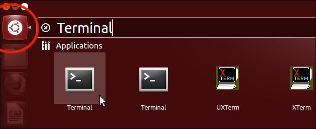

# System Setup for Linux (Ubuntu & Debian)

1. Click on the Ubuntu icon in the top left to open the Dash, type in "Terminal" and click on the matching application.<br><br>
   <br>
2. Copy the following text, paste it in the terminal and hit return.<br><br>
   ```sh
   curl -sL https://deb.nodesource.com/setup_11.x | sudo -E bash -
   ```
   This prepares the system to install Node.js.<br><br>
3. With each line below, copy the text, paste it in the terminal and hit return.<br><br>
   ```sh
   curl -sS https://dl.yarnpkg.com/debian/pubkey.gpg | sudo apt-key add -
   ```
   ```sh
   echo "deb https://dl.yarnpkg.com/debian/ stable main" | sudo tee /etc/apt/sources.list.d/yarn.list
   ```
   This prepares the system to install Yarn.<br><br>
4. With each line below, copy the text, paste it in the terminal and hit return.<br><br>
   ```sh
   curl -sL https://deb.nodesource.com/setup_11.x | sudo -E bash -
   ```
   ```sh
   curl https://packages.microsoft.com/keys/microsoft.asc | gpg --dearmor > microsoft.gpg
   ```
   ```sh
   sudo sh -c 'echo "deb [arch=amd64] https://packages.microsoft.com/repos/vscode stable main" > /etc/apt/sources.list.d/vscode.list'
   ```
   This prepares the system to install Visual Studio Code.<br><br>
5. With each line below, copy the text, paste it in the terminal and hit return.<br><br>
   ```sh
   sudo apt-get update
   ```
   ```sh
   sudo apt-get install -y apt-transport-https
   ```
   ```sh
   sudo apt-get update
   ```
   ```sh
   sudo apt-get install -y git nodejs yarn code
   ```
   This uses apt to install Git, Node.js, Yarn and Visual Studio Code.<br><br>
6. We recommend installing and using Chrome so that you have the same Devtools as others.<br><br>
   If you don't have Chrome installed yet, you can install it with Homebrew. To do this, with each line below, copy the text, paste it in the terminal and hit return.<br><br>
   ```sh
   wget -q -O - https://dl-ssl.google.com/linux/linux_signing_key.pub | sudo apt-key add -
   ```
   ```sh
   echo 'deb [arch=amd64] http://dl.google.com/linux/chrome/deb/ stable main' | sudo tee /etc/apt/sources.list.d/google-chrome.list
   ```
   ```sh
   sudo apt-get update
   ```
   ```sh
   sudo apt-get install -y google-chrome-stable
   ```
   This uses apt to install Chrome.<br><br>
7. Install the [Refined GitHub Chrome Extension](https://chrome.google.com/webstore/detail/refined-github/hlepfoohegkhhmjieoechaddaejaokhf?hl=en)
8. Install the [React Developer tools Chrome Extension](https://chrome.google.com/webstore/detail/react-developer-tools/fmkadmapgofadopljbjfkapdkoienihi?hl=en)
9. Copy the following text, paste it in the terminal and hit return.<br><br>
   ```sh
   npx create-react-app --help
   ```
   This will prepare a program that we will use in the course.<br><br>
10. The preparation will take a while and then respond with a message that some modules have been installed, similar to this:<br><br>
    <br><br>
11. Next we will configure VS Code.<br><br>
    Open VS Code and then press the keys <kbd>Ctrl</kbd>-<kbd>Shift</kbd>-<kbd>P</kbd>. Type in "Settings" and select the item that says `Preferences: Open Settings (JSON)`:<br><br>
    <br><br>
    Once the settings file is open, we will want to add the settings below.<br><br>
    First of all, identify whether your settings file is empty or not. This is what an empty file looks like:<br><br>
    <br><br>
    If your file is **not empty** (if there is more text within the curly brackets), then **we will need to do something extra** - add a comma on the second to last line:<br><br>
    <br><br>
    Now in both cases you will want to paste the following settings **before the closing curly bracket (before the `}`)**:<br><br>
    ```json
     "editor.wordWrap": "on",
     "editor.minimap.enabled": false,
     "editor.formatOnSave": true,
     "files.autoSave": "onFocusChange",
     "explorer.openEditors.visible": 0,
     "editor.tabSize": 2,
     "workbench.editor.tabSizing": "shrink",
     "workbench.editor.closeEmptyGroups": false,
     "prettier.singleQuote": true,
     "prettier.trailingComma": "all",
     "[markdown]": {
       "files.trimTrailingWhitespace": false
     },
    ```
    If you had any previous settings beforehand, you may notice that some text above will be underlined by a squiggly yellow line. This is a warning because we pasted some duplicate properties from the code above.<br><br>
    If you have any of these warnings, we should fix them. For each one of these lines with the warnings on them, delete the full line, including the comma at the end. We usually like to select from the start of the first `"` to just before the next `"` on the next line:<br><br>
    <br><br>
12. Set up PostgreSQL (refer to [the instructions in the official docs](https://www.postgresql.org/download/linux/ubuntu/))
13. Set the PostgreSQL password (refer to [the instructions here on Server Fault](https://serverfault.com/a/325596/146733))
14. Set up Docker (refer to [the instructions in the official docs](https://docs.docker.com/install/linux/docker-ce/ubuntu/))
15. If you haven't set a name on GitHub yet, go to the [GitHub Profile Settings](https://github.com/settings/profile) and add a name:<br><br>
    <br><br>
    We will use this name in the next step.<br><br>
16. For this step, we'll need to **edit some of the information in the commands** by adding our own information.<br><br>
    First of all, we will set our name, which will be the same name as on our GitHub profile:<br><br>
    <br><br>
    Copy your name from your profile, **add it in quotes** in the command (replace `Mona Lisa Octocat`) and run the command:<br><br>
    ```sh
    git config --global user.name "Mona Lisa Octocat"
    ```
    You can test whether the name was set correctly with the next command (if it worked, it will print the name on the next line):<br><br>
    ```sh
    git config --global user.name
    ```
    <br>For running the next command, **add your email in quotes**:<br><br>
    ```sh
    git config --global user.email "monalisaoctocat@example.com"
    ```
    You can test whether the email was set correctly with with the next command (if it worked, it will print the email on the next line):<br><br>
    ```sh
    git config --global user.email
    ```
    This prepares `git` so that your work is attributed correctly to you.<br><br>
17. Copy the following text, paste it in the terminal and hit return.<br><br>
    ```sh
    git config --global credential.helper cache
    ```
    This step will save your GitHub password for 15 minutes so that you don't need to enter it every time.<br><br>
