1. Click on the magnifying glass at the very top right of your screen to open the Spotlight search, enter "terminal.app" and hit return:<br><br>
   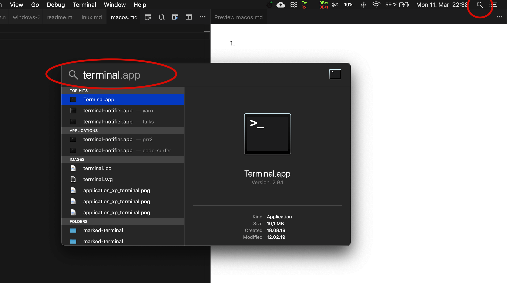
   <br>This will launch the macOS terminal.<br><br>
2. Copy the following text, paste it in the terminal and hit return.<br><br>
   ```sh
   xcode-select --install
   ```
   It will pop up a prompt similar to the screenshot below. Click "Install":<br><br>
   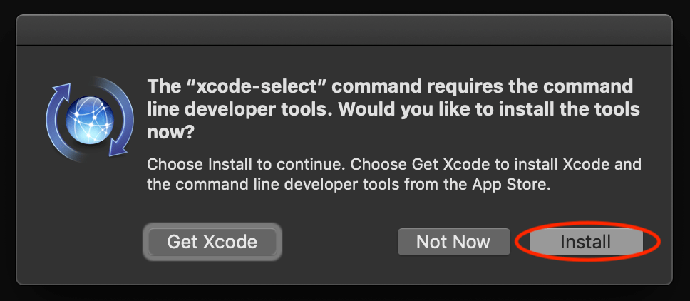<br><br>
   This will install the Xcode Command Line Tools, tools that enable installation of other software.<br><br>
3. Copy the following text, paste it in the terminal and hit return.<br><br>
   ```sh
   /usr/bin/ruby -e "$(curl -fsSL https://raw.githubusercontent.com/Homebrew/install/master/install)"
   ```
   This will install Homebrew, a package manager which will allow us to install and uninstall programs from the terminal.<br><br>
4. Hit return when the installer asks you to:<br><br>
   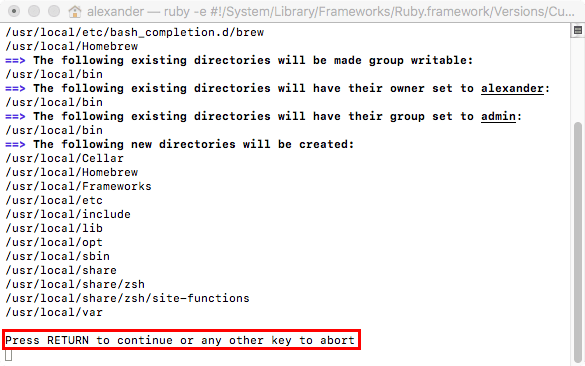
   <br><br>Also enter your Mac password when the installer asks you to. Note: while typing your password, you will not see the letters being entered. This is normal:<br><br>
   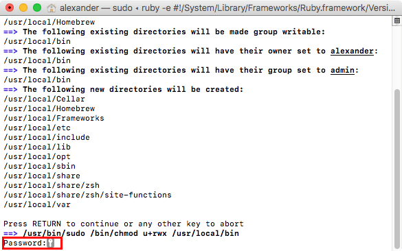<br><br>
5. The installer will take a bit of time and then show a message that "Installation successful!", signaling that it is done:<br><br>
   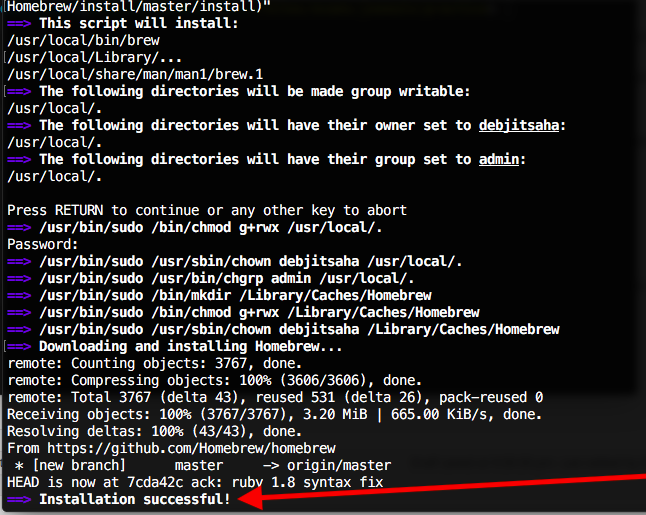<br><br>
6. Copy the following text, paste it in the terminal and hit return.<br><br>
   ```sh
   brew install git node yarn
   ```
   This uses Homebrew to install Git, Node.js and Yarn.<br><br>
7. Copy the following text, paste it in the terminal and hit return.<br><br>
   ```sh
   brew cask install visual-studio-code zoomus slack
   ```
   This uses Homebrew Cask to install Visual Studio Code, Zoom and Slack.<br><br>
8. Copy each line in the following text, paste it in the terminal and hit return.<br><br>
   ```sh
   code --install-extension esbenp.prettier-vscode
   code --install-extension jpoissonnier.vscode-styled-components
   code --install-extension forbeslindesay.vscode-sql-template-literal
   code --install-extension sysoev.vscode-open-in-github
   code --install-extension kumar-harsh.graphql-for-vscode
   code --install-extension dbaeumer.vscode-eslint
   code --install-extension wix.glean
   ```
   This installs some VS Code extensions we will need.<br><br>
9. We recommend installing and using Chrome so that you have the same Devtools as others.<br><br>
   If you don't have Chrome installed yet, you can install it with Homebrew. To do this, copy the following text, paste it in the terminal and hit return.<br><br>
   ```sh
   brew cask install visual-studio-code
   ```
   This uses Homebrew to install Chrome.<br><br>
10. Install the [Refined GitHub Chrome Extension](https://chrome.google.com/webstore/detail/refined-github/hlepfoohegkhhmjieoechaddaejaokhf?hl=en)
11. Install the [React Developer tools Chrome Extension](https://chrome.google.com/webstore/detail/react-developer-tools/fmkadmapgofadopljbjfkapdkoienihi?hl=en)
12. Copy the following text, paste it in the terminal and hit return.<br><br>
    ```sh
    npx create-react-app --help
    ```
    This step will prepare a program that we will use in the course.<br><br>
13. The preparation will take a while and then respond with a message that some modules have been installed, similar to this:<br><br>
    <br><br>
14. Next we will configure VS Code.<br><br>
    Open VS Code and then press the keys <kbd>cmd</kbd>-<kbd>shift</kbd>-<kbd>P</kbd>. Type in "Settings" and select the item that says `Preferences: Open Settings (JSON)`:<br><br>
    <br><br>
    Once the settings file is open, we will want to add the settings below.<br><br>
    First of all, identify whether your settings file is empty or not. This is what an empty file looks like:<br><br>
    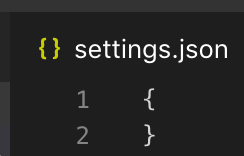<br><br>
    If your file is **not empty** (if there is more text within the curly brackets), then **we will need to do something extra** - add a comma on the second to last line:<br><br>
    <br><br>
    Now in both cases you will want to paste the following settings **before the closing curly bracket (before the `}`)**:<br><br>
    ```json
     "editor.wordWrap": "on",
     "editor.minimap.enabled": false,
     "editor.formatOnSave": true,
     "files.autoSave": "onFocusChange",
     "explorer.openEditors.visible": 0,
     "editor.tabSize": 2,
     "workbench.editor.tabSizing": "shrink",
     "workbench.editor.closeEmptyGroups": false,
     "prettier.singleQuote": true,
     "prettier.trailingComma": "all",
     "[markdown]": {
       "files.trimTrailingWhitespace": false
     },
    ```
    If you had any previous settings beforehand, you may notice that some text above will be underlined by a squiggly yellow line. This is a warning because we pasted some duplicate properties from the code above.<br><br>
    If you have any of these warnings, we should fix them. For each one of these lines with the warnings on them, delete the full line, including the comma at the end. We usually like to select from the start of the first `"` to just before the next `"` on the next line:<br><br>
    <br><br>
15. <a name="postgresql"></a>We will now install PostgreSQL. Copy the following text, paste it in the terminal and hit return.

    ```sh
    brew install postgresql
    ```

    This uses Homebrew to install PostgreSQL and create just a single user with your username and all role permissions. There will be no `postgres` user set up.<br><br>
    Now let's set an environment variable to tell PostgreSQL where to put the data:

    ```sh
    echo "export PGDATA=/usr/local/var/postgres" >> ~/.bash_profile
    source ~/.bash_profile
    ```

    We can now test whether PostgreSQL has been correctly installed by starting the database. To do this, we can run the following command:

    ```sh
    postgres
    ```

    If it worked, it should print out some lines with some messages that the database started and it is ready to accept connections:

    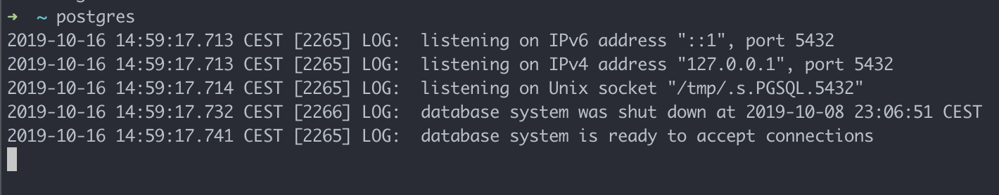<br><br>

    You will need to run this every time you want to use your database.<br><br>
    When you want to stop PostgreSQL again, just stop it like any other command line program using the shortcut <kbd>control</kbd>-<kbd>C</kbd>.

    Now we will connect to PostgreSQL using a tool called `psql` and add a new table, to make sure everything is working with the connection.

    Open a new tab in the terminal using <kbd>command</kbd>-<kbd>T</kbd> and run the following command:

    ```sh
    psql postgres
    ```

    It should look like this:<br><br>

    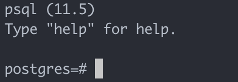<br><br>

    If your screen looks like the above screenshot, type in or copy and paste the following query (this is a language called SQL):

    ```sql
    CREATE TABLE users(
      id serial PRIMARY KEY,
      first_name VARCHAR (100) NOT NULL,
      last_name VARCHAR (100) NOT NULL
    );
    ```

    It should print `CREATE TABLE` on the line after running the query. Your screen should look like this:<br><br>

    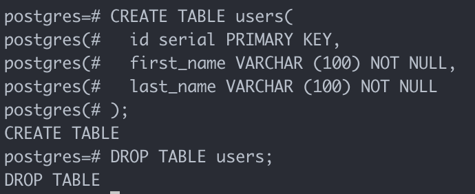<br><br>

    Now let's check that the table has been created. Run this query:

    ```
    \dt
    ```

    This will show the tables that you have, including the newly-created `users` table. Your screen should look like this:<br><br>

    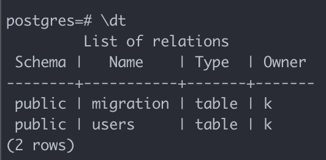<br><br>

    Finally, let's delete the table again to clean up. Run this query:

    ```sql
    DROP TABLE users;
    ```

    It should print `DROP TABLE` on the line after running the query. Your screen should look like this:<br><br>

    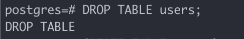<br><br>

    Great, PostgreSQL is set up! 🚀 Now you can exit from `psql` again by writing `exit` and hitting return:

    ```
    exit
    ```

    It should exit and send you back to the command line. Your screen should look similar to this (the last line will not be exactly the same):<br><br>

    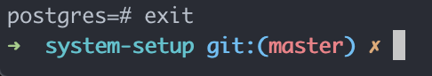<br><br>

    Now close the new tab in Hyper with <kbd>command</kbd>-<kbd>W</kbd>, and stop PostgreSQL again using <kbd>control</kbd>-<kbd>C</kbd>. PostgreSQL should shut down - your screen should look similar to this (the last line will not be exactly the same):<br><br>

    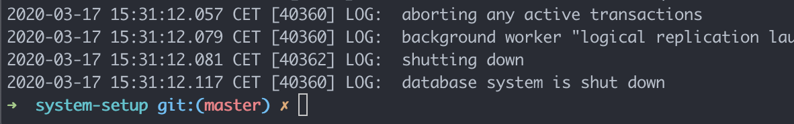<br><br>

16. <a name="docker"></a>We will now install Docker. Copy the following text, paste it in the terminal and hit return.

    ```sh
    brew cask install docker
    open /Applications/Docker.app
    ```

    This uses Homebrew Cask to install Docker for Mac and starts it for the first time to set it up. Wait for a message at the top of the window to indicate that everything is finished being set up:<br><br>
    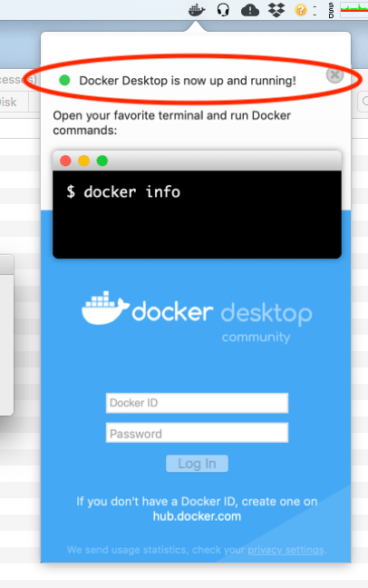<br><br>

17. Test if Docker is installed by running the following command on the command line:

    ```sh
    docker run hello-world
    ```

    It should print out a welcome message like this:<br><br>
    <br><br>

18. If you haven't set a name on GitHub yet, go to the [GitHub Profile Settings](https://github.com/settings/profile) and add a name:<br><br>
    <br><br>
    We will use this name in the next step.<br><br>
19. For this step, we'll need to **edit some of the information in the commands** by adding our own information.<br><br>
    First of all, we will set our name, which will be the same name as on our GitHub profile:<br><br>
    <br><br>
    Copy your name from your profile, **add it in quotes** in the command (replace `Mona Lisa Octocat`) and run the command:<br><br>
    ```sh
    git config --global user.name "Mona Lisa Octocat"
    ```
    You can test whether the name was set correctly with the next command (if it worked, it will print the name on the next line):<br><br>
    ```sh
    git config --global user.name
    ```
    <br>For running the next command, **add your email in quotes**:<br><br>
    ```sh
    git config --global user.email "monalisaoctocat@example.com"
    ```
    You can test whether the email was set correctly with with the next command (if it worked, it will print the email on the next line):<br><br>
    ```sh
    git config --global user.email
    ```
    This prepares `git` so that your work is attributed correctly to you.<br><br>
20. Copy the following text, paste it in the terminal and hit return.<br><br>
    ```sh
    git config --global credential.helper osxkeychain
    ```
    This step will save your GitHub password so that you don't need to enter it every time.<br><br>
21. Click on Applications in the dock and start Slack. Log in to the UpLeveled Slack.
22. On your phone, go to the app store and install Slack on your phone. Log in to the UpLeveled Slack.
