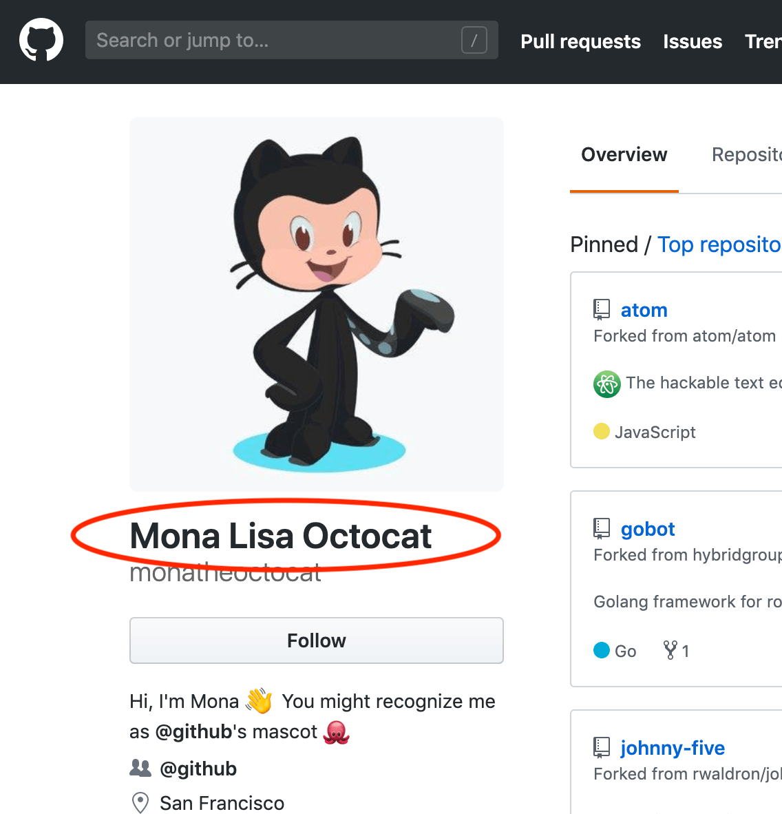

1. Click on the magnifying glass at the very top right of your screen to open the Spotlight search, enter "terminal.app" and hit return:<br><br>
   
   <br>This will launch the macOS terminal.<br><br>
2. Copy the following text, paste it in the terminal and hit return.<br><br>
   ```sh
   /usr/bin/ruby -e "$(curl -fsSL https://raw.githubusercontent.com/Homebrew/install/master/install)"
   ```
   This will install Homebrew, a package manager which will allow us to install and uninstall programs from the terminal.<br><br>
3. Hit return when the installer asks you to:<br><br>
   
   <br><br>Also enter your Mac password when the installer asks you to. Note: while typing your password, you will not see the letters being entered. This is normal:<br><br>
   <br><br>
4. The installer will take a bit of time and then show a message that "Installation successful!", signaling that it is done:<br><br>
   <br><br>
5. Copy the following text, paste it in the terminal and hit return.<br><br>
   ```sh
   brew install git node yarn
   ```
   This uses Homebrew to install Git, Node.js and Yarn.<br><br>
6. Copy the following text, paste it in the terminal and hit return.<br><br>
   ```sh
   brew cask install visual-studio-code
   ```
   This uses Homebrew to install Visual Studio Code.<br><br>
7. Copy the following text, paste it in the terminal and hit return.<br><br>
   ```sh
   npx create-react-app --help
   ```
   This step will prepare a program that we will use in the course.<br><br>
8. The preparation will take a while and then respond with a message that some modules have been installed, similar to this:<br><br>
   <br><br>
9. If you haven't set a name on GitHub yet, go to the [GitHub Profile Settings](https://github.com/settings/profile) and add a name:<br><br>
   <br><br>
   We will use this name in the next step.<br><br>
10. For this step, we'll need to **edit some of the information in the commands** by adding our own information.<br><br>
    First of all, we will set our name, which will be the same name as on our GitHub profile:<br><br>
    <br><br>
    Copy your name from your profile, **add it in quotes** in the command (replace `Mona Lisa Octocat`) and run the command:<br><br>
    ```sh
    git config --global user.name "Mona Lisa Octocat"
    ```
    You can test whether the name was set correctly with the next command (if it worked, it will print the name on the next line):<br><br>
    ```sh
    git config --global user.name
    ```
    <br>For running the next command, **add your email in quotes**:<br><br>
    ```sh
    git config --global user.email "monalisaoctocat@example.com"
    ```
    You can test whether the email was set correctly with with the next command (if it worked, it will print the email on the next line):<br><br>
    ```sh
    git config --global user.email
    ```
    This prepares `git` so that your work is attributed correctly to you.<br><br>
11. Copy the following text, paste it in the terminal and hit return.<br><br>
    ```sh
    git config --global credential.helper osxkeychain
    ```
    This step will save your GitHub password so that you don't need to enter it every time.<br><br>
