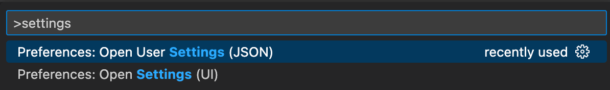

1. Click on the magnifying glass at the very top right of your screen to open the Spotlight search, enter "terminal.app" and hit return:<br><br>
   
   <br>This will launch the macOS terminal.<br><br>
2. Copy the following text, paste it in the terminal and hit return.<br><br>
   ```bash
   xcode-select --install
   ```
   It will pop up a prompt similar to the screenshot below. Click "Install":<br><br>
   <br><br>
   This will install the Xcode Command Line Tools, tools that enable installation of other software.<br><br>
3. Copy the following text, paste it in the terminal and hit return.<br><br>
   ```bash
   /bin/bash -c "$(curl -fsSL https://raw.githubusercontent.com/Homebrew/install/HEAD/install.sh)"
   ```
   This will install Homebrew, a package manager which will allow us to install and uninstall programs from the terminal.<br><br>
4. When the installer asks for it, enter your password you use to log in to your Mac<br><br>
   ‼️ Note: while typing your password, you will not see the letters being entered. This is normal:<br><br>
   <br><br>
   Also press return when asked to:<br><br>
   <br><br>
5. The installer will take a bit of time and then show a message that "Installation successful!", signaling that it is done:<br><br>
   <br><br>
   Read the messages underneath the "Installation successful!" message and look for a heading that says "Next steps". If there is a bullet point with the text "Add Homebrew to your PATH...", then there are be some additional commands that you need to copy and run (copy each line, paste it in the terminal and hit return):<br><br>
   <br><br>
6. Copy the following text, paste it in the terminal and hit return.<br><br>
   ```bash
   brew install git node@16 yarn flyctl
   ```
   This uses Homebrew to install Git, Node.js, Yarn and `flyctl`.<br><br>
7. Copy each line in the following text, paste it in the terminal and hit return.<br><br>
   ```bash
   brew tap microsoft/git
   brew install --cask visual-studio-code postman git-credential-manager-core
   ```
   This uses Homebrew Cask to install Visual Studio Code, Postman and Git Credential Manager Core.<br><br>
   If you don't have Zoom installed yet, run this to install it:<br>
   ```bash
   brew install --cask zoom
   ```
   If you don't have Slack installed yet, run this to install it:<br>
   ```bash
   brew install --cask slack
   ```
8. <a name="vs-code-extensions"></a> Copy each line in the following text, paste it in the terminal and hit return.<br><br>

   ```bash
   code --install-extension Cardinal90.multi-cursor-case-preserve
   code --install-extension dbaeumer.vscode-eslint
   code --install-extension dozerg.tsimportsorter
   code --install-extension esbenp.prettier-vscode
   code --install-extension frigus02.vscode-sql-tagged-template-literals-syntax-only
   code --install-extension styled-components.vscode-styled-components
   code --install-extension kumar-harsh.graphql-for-vscode
   code --install-extension meganrogge.template-string-converter
   code --install-extension stylelint.vscode-stylelint
   code --install-extension sysoev.vscode-open-in-github
   code --install-extension mattpocock.ts-error-translator
   code --install-extension wix.glean
   ```

   This installs some VS Code extensions we will need.<br><br>

9. We recommend installing and using Chrome so that you have the same DevTools as others.<br><br>
   If you don't have Chrome installed yet, you can install it with Homebrew. To do this, copy the following text, paste it in the terminal and hit return.<br><br>
   ```bash
   brew install --cask google-chrome
   ```
   This uses Homebrew to install Chrome.<br><br>
10. Install the following Chrome Extensions:
    - [React Developer tools Chrome Extension](https://chrome.google.com/webstore/detail/react-developer-tools/fmkadmapgofadopljbjfkapdkoienihi?hl=en)
    - [Refined GitHub Chrome Extension](https://chrome.google.com/webstore/detail/refined-github/hlepfoohegkhhmjieoechaddaejaokhf?hl=en)
    - [Web Vitals Chrome Extension](https://chrome.google.com/webstore/detail/web-vitals/ahfhijdlegdabablpippeagghigmibma?hl=en))
11. Copy the following text, paste it in the terminal and hit return.<br><br>

    ```bash
    yarn create react-app --help
    ```

    This step will prepare a program that we will use in the course. This will take a while and then respond with a message that some modules have been installed, similar to this:<br><br>
    <br><br>

12. Copy the following text, paste it in the terminal and hit return.<br><br>
    ```bash
    yarn global add @upleveled/preflight
    ```
    This will prepare a program that we will use in the course.<br><br>
13. <a name="vs-code-settings"></a> Next we will configure VS Code.<br><br>
    Open VS Code and then press the keys <kbd>cmd</kbd>-<kbd>shift</kbd>-<kbd>P</kbd>. Type in "Settings" and select the item that says `Preferences: Open Settings (JSON)`:<br><br>
    <br><br>
    Once the settings file is open, we will want to add the settings below.<br><br>
    First of all, identify whether your settings file is empty or not. This is what an empty file looks like:<br><br>
    <br><br>
    If your file is **not empty** (if there is more text within the curly brackets), then **we will need to do something extra** - add a comma on the second to last line:<br><br>
    <br><br>
    Now in both cases you will want to paste the following settings **before the closing curly bracket (before the `}`)**:<br><br>
    ```json5
    "editor.wordWrap": "on",
    "editor.minimap.enabled": false,
    "editor.formatOnSave": true,
    "tsImportSorter.configuration.groupRules": ["^node:", {}, "^[.]"],
    "tsImportSorter.configuration.keepUnused": [".*"],
    "tsImportSorter.configuration.emptyLinesBetweenGroups": 0,
    "tsImportSorter.configuration.wrappingStyle": "prettier",
    "editor.defaultFormatter": "esbenp.prettier-vscode",
    "[html]": {
      "editor.defaultFormatter": "esbenp.prettier-vscode"
    },
    "[javascript]": {
      "editor.defaultFormatter": "esbenp.prettier-vscode"
    },
    "[javascriptreact]": {
      "editor.defaultFormatter": "esbenp.prettier-vscode"
    },
    "[typescript]": {
      "editor.defaultFormatter": "esbenp.prettier-vscode"
    },
    "[typescriptreact]": {
      "editor.defaultFormatter": "esbenp.prettier-vscode"
    },
    "[json]": {
      "editor.defaultFormatter": "esbenp.prettier-vscode"
    },
    "[jsonc]": {
      "editor.defaultFormatter": "esbenp.prettier-vscode"
    },
    "files.autoSave": "onFocusChange",
    "explorer.openEditors.visible": 0,
    "editor.tabSize": 2,
    "files.insertFinalNewline": true,
    "files.trimFinalNewlines": true,
    "files.trimTrailingWhitespace": true,
    "[markdown]": {
      "files.trimTrailingWhitespace": false
    },
    "workbench.editor.tabSizing": "shrink",
    "workbench.editor.closeEmptyGroups": false,
    "prettier.singleQuote": true,
    "prettier.trailingComma": "all",
    "eslint.runtime": "node",
    ```
    If you had any previous settings beforehand, you may notice that some text above will be underlined by a squiggly yellow line. This is a warning because we pasted some duplicate properties from the code above.<br><br>
    If you have any of these warnings, we should fix them. For each one of these lines with the warnings on them, delete the full line, including the comma at the end. We usually like to select from the start of the first `"` to just before the next `"` on the next line:<br><br>
    <br><br>
14. <a name="postgresql"></a>We will now install PostgreSQL. Copy the following text, paste it in the terminal and hit return.

    ```bash
    brew install postgresql
    ```

    This uses Homebrew to install PostgreSQL and create just a single user with your username and all role permissions. There will be no `postgres` user set up.<br><br>
    Now let's set an environment variable to tell PostgreSQL where to put the data:

    ```bash
    [[ -d /opt/homebrew/var/postgresql@14 ]] && PGDATA_TMP=/opt/homebrew/var/postgresql@14 || PGDATA_TMP=/usr/local/var/postgres
    echo "export PGDATA=$PGDATA_TMP" >> ~/`[[ $SHELL == *"zsh" ]] && echo '.zshrc' || echo '.bash_profile'`
    source ~/`[[ $SHELL == *"zsh" ]] && echo '.zshrc' || echo '.bash_profile'`
    ```

    We can now test whether PostgreSQL has been correctly installed by starting the database. To do this, we can run the following command:

    ```bash
    postgres
    ```

    If it worked, it should print out some lines with some messages and end with the rectangular cursor on the left side of the screen:

    <br><br>

    The messages may be different than the messages in the image above, and may not mention that PostgreSQL is ready to accept connections:

    <br><br>

    You will need to run this every time you want to use your database.<br><br>
    When you want to stop PostgreSQL again, just stop it like any other command line program using the shortcut <kbd>control</kbd>-<kbd>C</kbd>.

    Now we will connect to PostgreSQL using a tool called `psql` and add a new table, to make sure everything is working with the connection.

    Open a new tab in the terminal using <kbd>command</kbd>-<kbd>T</kbd> and run the following command:

    ```bash
    psql postgres
    ```

    It should look like this:<br><br>

    <br><br>

    If your screen looks like the above screenshot, type in or copy and paste the following query (this is a language called SQL):

    ```sql
    CREATE TABLE users(
      id serial PRIMARY KEY,
      first_name VARCHAR (100) NOT NULL,
      last_name VARCHAR (100) NOT NULL
    );
    ```

    It should print `CREATE TABLE` on the line after running the query. Your screen should look like this:<br><br>

    <br><br>

    Now let's check that the table has been created. Run this query:

    ```
    \dt
    ```

    This will show the tables that you have, including the newly-created `users` table. Your screen should look like this:<br><br>

    <br><br>

    Finally, let's delete the table again to clean up. Run this query:

    ```sql
    DROP TABLE users;
    ```

    It should print `DROP TABLE` on the line after running the query. Your screen should look like this:<br><br>

    <br><br>

    Great, PostgreSQL is set up! 🚀 Now you can exit from `psql` again by writing `exit` and hitting return:

    ```
    exit
    ```

    It should exit and send you back to the command line. Your screen should look similar to this (the last line will not be exactly the same):<br><br>

    <br><br>

    Now close the new terminal tab with <kbd>command</kbd>-<kbd>W</kbd>, and stop PostgreSQL again using <kbd>control</kbd>-<kbd>C</kbd>. PostgreSQL should shut down - your screen should look similar to this (the last line will not be exactly the same):<br><br>

    <br><br>

15. <a name="docker"></a>We will now install Docker. Copy the following text, paste it in the terminal and hit return.

    ```bash
    brew install --cask docker
    open /Applications/Docker.app
    ```

    This uses Homebrew Cask to install Docker for Mac and starts it for the first time to set it up. Wait for a message at the top of the window to indicate that everything is finished being set up:<br><br>
    <br><br>

16. Test if Docker is installed by running the following command on the command line:

    ```bash
    docker run hello-world
    ```

    It should print out a welcome message like this:<br><br>
    <br><br>

17. <a name="expo-react-native"></a>We will now install Expo CLI for React Native.

    Copy the following text, paste it in the terminal and hit return.

    ```bash
    npm install -g expo-cli
    ```

    You can ignore the lines marked `WARN` - these do not indicate problems:<br><br>

    <br><br>

    Lastly, we'll install Expo on your phone, so that you can also test on a real device.

    On your phone, go to the app store and install Expo on your phone ([Android](https://play.google.com/store/apps/details?id=host.exp.exponent&hl=en&gl=US), [iOS](https://apps.apple.com/us/app/expo-go/id982107779)). Create an account and log in.

18. Next we will set up some dependencies for Expo and React Native.

    Copy each line in the following text, paste it in the terminal and hit return.

    ```bash
    brew install --cask android-studio
    [ -d "$HOME/Library/Android/sdk" ] && ANDROID_SDK=$HOME/Library/Android/sdk || ANDROID_SDK=$HOME/Android/Sdk
    echo "export ANDROID_SDK=$ANDROID_SDK" >> ~/`[[ $SHELL == *"zsh" ]] && echo '.zshenv' || echo '.bash_profile'`
    echo "export PATH=$HOME/Library/Android/sdk/platform-tools:\$PATH" >> ~/`[[ $SHELL == *"zsh" ]] && echo '.zshenv' || echo '.bash_profile'`
    source ~/`[[ $SHELL == *"zsh" ]] && echo '.zshenv' || echo '.bash_profile'`
    ```

    This will install Android Studio, for creating and running Android virtual devices in an emulator.

    Open Android Studio using the Spotlight or locating it in Applications.

    If it asks to import Android Studio Settings, choose **Do not import settings**.

    When prompted, choose a **Custom** install:<br><br>

    <br><br>

    Leave the default JDK installation location as-is and click **Next**:<br><br>

    <br><br>

    Uncheck the box next to **Android Virtual Device** (we will install our own manually):<br><br>

    <br><br>

    For each of the licenses with red stars next to them, click on the license name and then accept the agreement, finally clicking on **Finish** when you have accepted all agreements:<br><br>

    <br><br>

    This will download components, which may take a few minutes:<br><br>

    <br><br>

    Next will be getting a virtual device installed. Click on **More Actions** and select **Virtual Device Manager**:<br><br>

    <br><br>

    Click on the **Create device** button on the top left of the window:<br><br>

    <br><br>

    Select the Pixel 3a as the hardware device.

    Under the **Recommended** tab (the default tab), locate the system image named **R** (API level 30) and click on the **Download** link next to it. In the window that pops up, accept the license agreement and click **Next**:<br><br>

    <br><br>

    Once the download completes, select the image you just downloaded and click on **Next** through the rest of the steps until the virtual device has been created:<br><br>

    <br><br>

    The device will now show up in the Device Manager. Click on the triangular play button to launch the virtual device in the emulator. An emulator window will appear showing the screen of the virtual device:<br><br>

    <br><br>

    If a message pops up in the virtual device that the "System UI isn't responding" at any point during these steps, you can click on "Wait".

    Before running the first Expo app, test that the Android Studio `adb` (Android Debug Bridge) program has been set up properly, by running the following in a new Terminal (open a new tab):

    ```bash
    adb
    ```

    It should print the version and help information:<br><br>

    <br><br>

19. To verify that Expo is working with the Android Studio virtual device copy and run each of these lines separately in the terminal:

    ```bash
    cd ~
    mkdir -p projects
    cd projects
    yarn create expo-app expo-test --template blank
    cd expo-test
    yarn start --android
    ```

    This will create a new Expo demo app and start it.

    If this step doesn't work, it's possible that you may not have the emulator running - check the last part of the previous step to see how to launch the emulator.

    The first thing that you will see is the installation of Expo Go on the virtual device:<br><br>

    <br><br>

    Next, the Metro bundler will bundle the JavaScript for the device, which may take some time. You will see a loading bar in the command line and a loading screen on the virtual device:<br><br>

    <br><br>

    <br><br>

    After the bundling has completed, the simple app should show up in the virtual device, with the words "Open up App.js to start working on your app!":<br><br>

    <br><br>

    Click on the small `x` at the top right of the virtual device frame to stop the virtual device - this will save a snapshot to make starting the virtual device faster in the future.

20. If you don't have one yet, create a Google account [here](https://accounts.google.com/signup?hl=en). Send the email address associated with this account to Karl (if you haven't already).
21. If you don't have one yet, create a GitHub account [here](https://github.com/join). Make sure to set a name.

    If you already have a GitHub account and you haven't set a name on GitHub yet, go to the [GitHub Profile Settings](https://github.com/settings/profile) and add a name:<br><br>
    <br><br>
    We will use this name in the next step.<br><br>

22. For this step, we'll need to **edit some of the information in the commands** by adding our own information.<br><br>
    First of all, we will set our name, which will be the same name as on our GitHub profile:<br><br>
    <br><br>
    Copy your name from your profile, **add it in quotes** in the command (replace `Mona Lisa Octocat`) and run the command:<br><br>
    ```bash
    git config --global user.name "Mona Lisa Octocat"
    ```
    You can test whether the name was set correctly with the next command (if it worked, it will print the name on the next line):<br><br>
    ```bash
    git config --global user.name
    ```
    <br>For running the next command, **add your email in quotes**:<br><br>
    ```bash
    git config --global user.email "monalisaoctocat@example.com"
    ```
    You can test whether the email was set correctly with with the next command (if it worked, it will print the email on the next line):<br><br>
    ```bash
    git config --global user.email
    ```
    This prepares `git` so that your work is attributed correctly to you.<br><br>

<!-- 23. Copy the following text, paste it in the terminal and hit return.<br><br>
    ```bash
    git config --global credential.helper osxkeychain
    ```
    This step will save your GitHub password so that you don't need to enter it every time.<br><br> -->

23. Copy the following text, paste it in the terminal and hit return.<br><br>
    ```bash
    git config --global init.defaultBranch main
    ```
    This step will change the default Git branch from `master` to `main` (see https://github.com/github/renaming).<br><br>
24. Go back to GitHub, and go to your profile page by clicking on your avatar at the top right and selecting **Your profile**<br><br>
    <br><br>
    Copy the `github.com/...` URL in the address bar of your browser, for use in the next step.
25. Click on Applications in the dock and start Slack. Log in to the UpLeveled Slack. Send your GitHub profile URL to Karl.
26. <a name="specs"></a>Click on the apple icon in the menu bar at the top left of your screen and select "About This Mac". Select "System Report...". Copy the "Hardware Overview" information in the right panel and send to Karl. Select "Software" in the left panel, copy the "System Software Overview" information and send to Karl.
27. On your phone, go to the app store and install Slack on your phone. Log in to the UpLeveled Slack.

## Optional Software

1. If you would like to check the spelling of all code you write in VS Code, try out [Code Spell Checker](https://marketplace.visualstudio.com/items?itemName=streetsidesoftware.code-spell-checker). You can install on the command line with this command:

   ```bash
   code --install-extension streetsidesoftware.code-spell-checker
   ```

2. If you want to easily capture screenshots and draw and write on them, try Flameshot:

   ```bash
   brew install --cask flameshot
   ```

3. If you need to record video of your screen with sound (with export to mp4 and gif), you may want to try out Kap:

   ```bash
   brew install --cask kap
   ```

4. If you would like to keep a history of what you have copied to your clipboard, you can try out Yippy:

   ```bash
   brew install --cask yippy
   ```

5. To simultaneously test your web design in multiple mobile viewports, try Responsively App:

   ```bash
   brew install --cask responsively
   ```

6. To remove secrets, large files or other undesirable files from your Git repository, try BFG Repo-Cleaner:

   ```bash
   brew install bfg
   ```

7. If you're running out of space on your computer, you can use Disk Inventory X to analyze your hard drive and show a chart of which items are taking up how much space:

   ```bash
   brew install --cask disk-inventory-x
   ```

8. To do natural language calculations and conversions, try [Numi](https://numi.app/):

   ```bash
   brew install --cask numi
   ```
