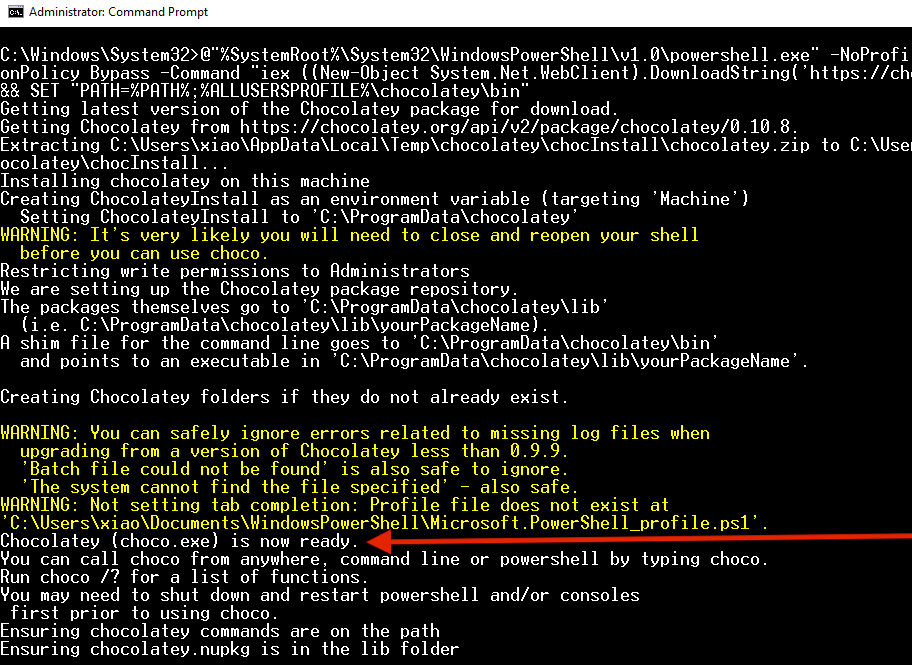

1. Open the Start menu and type "cmd.exe". Right-click on the item "Command Prompt" or "Eingabeaufforderung" that appears and choose "Run as administrator":<br>
   <br>
   
   <br>This will run the Command Prompt as an administrator user<br><br>
2. Copy the following text (be sure you select all of it, it's very long) and right-click in the black middle part of the Command Prompt window to paste the text. Hit enter.<br><br>
   ```sh
   @"%SystemRoot%\System32\WindowsPowerShell\v1.0\powershell.exe" -NoProfile -InputFormat None -ExecutionPolicy Bypass -Command "iex ((New-Object System.Net.WebClient).DownloadString('https://chocolatey.org/install.ps1'))" && SET "PATH=%PATH%;%ALLUSERSPROFILE%\chocolatey\bin"
   ```
   This will install Chocolatey, a package manager which will allow us to install and uninstall programs from the command prompt.
   <br>
3. The installer will take a bit of time and then show a message that "Chocolatey is ready", signaling that it is done:<br><br>
   <br><br>
4. Close the Command Prompt and open it again as administrator (like in step 1)<br><br>
5. Copy the following text and right-click in the black middle part of the Command Prompt window to paste the text. Hit enter.<br><br>
   ```sh
   choco install git nodejs yarn vscode -y
   ```
   This uses Chocolatey to install Git, Node.js, Yarn and Visual Studio Code.<br><br>
6. Close the Command Prompt and open it again as administrator (like in step 1)<br><br>
7. Copy the following text and right-click in the Command Prompt window to paste the text. Hit enter.<br><br>
   ```sh
   npx create-react-app --help
   ```
   This will prepare a program that we will use in the course.<br><br>
8. The preparation will take a while and then respond with a message that some modules have been installed, similar to this:<br><br>
   <br><br>
