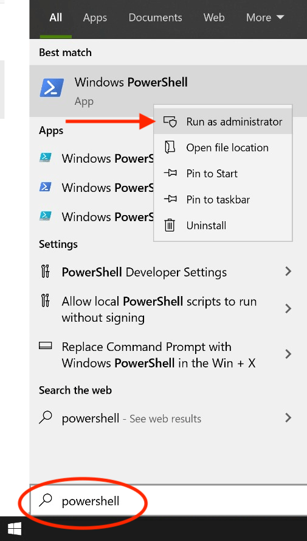
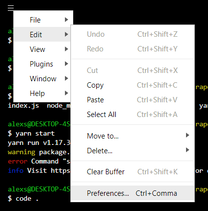
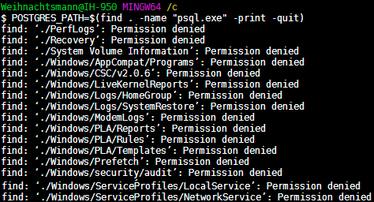

Before you start, please make sure that you're running Windows 8.1 or Windows 10. Some things may not work on Windows 7, since it is no longer supported as of early 2020.

1.  Open the Start menu and type "Windows Update". Make sure that you have all of the latest updates.
2.  Open the Start menu and type "powershell". Right-click on the item "Windows PowerShell" that appears and choose "Run as administrator":<br>
    <br>
    
    <br>This will run Powershell as an administrator user<br><br>
3.  Copy the following text (be sure you select all of it, it's very long) and right-click in the blue middle part of the PowerShell window to paste the text. Hit enter.<br><br>
    ```sh
    Set-ExecutionPolicy Bypass -Scope Process -Force; [System.Net.ServicePointManager]::SecurityProtocol = [System.Net.ServicePointManager]::SecurityProtocol -bor 3072; iex ((New-Object System.Net.WebClient).DownloadString('https://chocolatey.org/install.ps1'))
    ```
    This will install Chocolatey, a package manager which will allow us to install and uninstall programs from the command line.
    <br>
4.  The installer will take a bit of time and then show a message that "Chocolatey is ready", signaling that it is done:<br><br>
    <br><br>
5.  Close PowerShell and open it again as administrator (like in step 1)<br><br>
6.  Copy the following text and right-click in the blue middle part of the PowerShell window to paste the text. Hit enter.<br><br>
    ```sh
    choco install git nodejs yarn vscode hyper zoom slack -y
    ```
    This uses Chocolatey to install Git, Node.js, Yarn, Visual Studio Code, Hyper, Zoom and Slack.<br><br>
    **Note:** If you are using Windows 7, you may have encountered a problem with installing Node.js because [the latest versions no longer support Windows 7](https://github.com/nodejs/node/issues/33000). To get around this, run this separately: `choco install nodejs -y --version 13.6.0`<br><br>
7.  Copy each line in the following text, right-click in the blue middle part of the PowerShell window to paste the text and hit enter.<br><br>

    <!--
      vscode-styled-jsx conflicts with vscode-styled-components

      https://github.com/styled-components/vscode-styled-components/issues/208#issuecomment-646606763

      code --install-extension AndrewRazumovsky.vscode-styled-jsx-languageserver
      code --install-extension blanu.vscode-styled-jsx
    -->

    ```sh
    code --install-extension Cardinal90.multi-cursor-case-preserve
    code --install-extension dbaeumer.vscode-eslint
    code --install-extension esbenp.prettier-vscode
    code --install-extension forbeslindesay.vscode-sql-template-literal
    code --install-extension jpoissonnier.vscode-styled-components
    code --install-extension kumar-harsh.graphql-for-vscode
    code --install-extension meganrogge.template-string-converter
    code --install-extension sysoev.vscode-open-in-github
    code --install-extension wix.glean
    ```

    This installs some VS Code extensions we will need.<br><br>

8.  We recommend installing and using Chrome so that you have the same Devtools as others.<br><br>
    If you don't have Chrome installed yet, you can install it with Homebrew. To do this, copy the following text and right-click in the blue middle part of the PowerShell window to paste the text. Hit enter.<br><br>
    ```sh
    choco install chrome -y
    ```
    This uses Chocolatey to install Chrome.<br><br>
9.  Install the following Chrome Extensions:
    - [React Developer tools Chrome Extension](https://chrome.google.com/webstore/detail/react-developer-tools/fmkadmapgofadopljbjfkapdkoienihi?hl=en)
    - [Refined GitHub Chrome Extension](https://chrome.google.com/webstore/detail/refined-github/hlepfoohegkhhmjieoechaddaejaokhf?hl=en)
    - [Web Vitals Chrome Extension](https://chrome.google.com/webstore/detail/web-vitals/ahfhijdlegdabablpippeagghigmibma?hl=en)
10. Close PowerShell and open it again as administrator (like in step 1)<br><br>
11. Copy the following text and right-click in the PowerShell window to paste the text. Hit enter.<br><br>
    ```sh
    npx create-react-app --help
    ```
    This will prepare a program that we will use in the course.<br><br>
12. The preparation will take a while and then respond with a message that some modules have been installed, similar to this:<br><br>
    <br><br>
13. Next we will configure VS Code.<br><br>
    Open VS Code and then press the keys <kbd>Ctrl</kbd>-<kbd>Shift</kbd>-<kbd>P</kbd>. Type in "Settings" and select the item that says `Preferences: Open Settings (JSON)`:<br><br>
    <br><br>
    Once the settings file is open, we will want to add the settings below.<br><br>
    First of all, identify whether your settings file is empty or not. This is what an empty file looks like:<br><br>
    <br><br>
    If your file is **not empty** (if there is more text within the curly brackets), then **we will need to do something extra** - add a comma on the second to last line:<br><br>
    <br><br>
    Now in both cases you will want to paste the following settings **before the closing curly bracket (before the `}`)**:<br><br>
    ```json
     "editor.wordWrap": "on",
     "editor.minimap.enabled": false,
     "editor.formatOnSave": true,
     "files.autoSave": "onFocusChange",
     "explorer.openEditors.visible": 0,
     "editor.tabSize": 2,
     "files.trimTrailingWhitespace": true,
     "files.trimFinalNewlines": true,
     "[markdown]": {
       "files.trimTrailingWhitespace": false
     },
     "workbench.editor.tabSizing": "shrink",
     "workbench.editor.closeEmptyGroups": false,
     "prettier.singleQuote": true,
     "prettier.trailingComma": "all",
     "terminal.integrated.shell.windows": "C:\\Program Files\\Git\\bin\\bash.exe",
    ```
    If you had any previous settings beforehand, you may notice that some text above will be underlined by a squiggly yellow line. This is a warning because we pasted some duplicate properties from the code above.<br><br>
    If you have any of these warnings, we should fix them. For each one of these lines with the warnings on them, delete the full line, including the comma at the end. We usually like to select from the start of the first `"` to just before the next `"` on the next line:<br><br>
    <br><br>
14. Now we will configure Hyper.<br><br>
    Open Hyper and then select Edit -> Preferences, which will open a text file in an editor:<br><br>
    <br><br>
    In this file, we will do three things:

    1. Find `shell: '',` and replace it with `shell: 'C:\\Program Files\\Git\\git-cmd.exe',`
    2. Find `shellArgs: ['--login'],` and replace it with `shellArgs: ['--command=usr/bin/bash.exe', '-l', '-i'],`
    3. Find `env: {},` and replace it with `env: { TERM: 'cygwin' },`

    Then save the file and close and restart Hyper.

15. <a name="postgresql"></a>We will now install PostgreSQL. Search for Hyper in the start menu, then right click on it and choose "Run as Administrator".

    Copy the following text, paste it in Hyper and hit return.

    ```sh
    choco install postgresql12 --params '/Password:postgres'
    ```

    This will install PostgreSQL and create a default user of `postgres` and a password of `postgres`. Remember this password and use it any time it asks from now on.

    After the installation is complete, close Hyper and reopen it (just as a normal user - not as an administrator).

    Now let's set an environment variable to tell PostgreSQL where to find the programs and where to put the data. Copy and run each of these lines separately in Hyper:

    ```sh
    cd /c/
    POSTGRES_PATH=$(find . -name "psql.exe" -print -quit)
    POSTGRES_BIN_PATH=$(dirname "${POSTGRES_PATH/./\/c}")
    echo "export PATH=\$PATH:\"$POSTGRES_BIN_PATH\"" >> $USERPROFILE/.bash_profile
    echo "export PGDATA=\"${POSTGRES_BIN_PATH/bin/data}\"" >> $USERPROFILE/.bash_profile
    source $USERPROFILE/.bash_profile
    ```

    You may encounter some "Permission denied" warnings during some of these steps, which should be no problem:

    <br><br>

    We can now test whether PostgreSQL has been correctly installed by starting the database. To do this, we can run the following command:

    ```sh
    postgres
    ```

    If it worked, it should print out some lines with some messages that the database started and it is ready to accept connections:

    <br><br>

    You will need to run this every time you want to use your database.

    When you want to stop PostgreSQL again, just stop it like any other command line program using the shortcut <kbd>control</kbd>-<kbd>C</kbd>.

    Now we will connect to PostgreSQL using a tool called `psql` and add a new table, to make sure everything is working with the connection.

    Open a new tab in Hyper using <kbd>control</kbd>-<kbd>shift</kbd>-<kbd>T</kbd> and run the following command:

    ```sh
    psql -U postgres
    ```

    It will ask you for a password - enter `postgres` (the password will not be visible). Now it should look like this:<br><br>

    <br><br>

    If your screen looks like the above screenshot, type in or copy and paste the following query (this is a language called SQL):

    ```sql
    CREATE TABLE users(
      id serial PRIMARY KEY,
      first_name VARCHAR (100) NOT NULL,
      last_name VARCHAR (100) NOT NULL
    );
    ```

    It should print `CREATE TABLE` on the line after running the query. Your screen should look like this:<br><br>

    <br><br>

    Now let's check that the table has been created. Run this query:

    ```
    \dt
    ```

    This will show the tables that you have, including the newly-created `users` table. Your screen should look like this:<br><br>

    <br><br>

    Finally, let's delete the table again to clean up. Run this query:

    ```sql
    DROP TABLE users;
    ```

    It should print `DROP TABLE` on the line after running the query. Your screen should look like this:<br><br>

    <br><br>

    Great, PostgreSQL is set up! 🚀 Now you can exit from `psql` again by writing `exit` and hitting return:

    ```
    exit
    ```

    It should exit and send you back to the command line. Your screen should look similar to this (the last line will not be exactly the same):<br><br>

    <br><br>

    Now close the new tab in Hyper with <kbd>control</kbd>-<kbd>W</kbd>, and stop PostgreSQL again using <kbd>control</kbd>-<kbd>C</kbd>. PostgreSQL should shut down - your screen should look similar to this (the last line will not be exactly the same):<br><br>

    <br><br>

16. <a name="docker"></a>We will now install Docker.

    **Option A - Windows 10 Pro:**

    1. Search for Hyper in the start menu, then right click on it and choose "Run as Administrator".
    2. Copy the following text and paste it into Hyper. Hit enter.

    ```sh
    choco install docker-desktop -y
    ```

    3. Open start menu and search for "Docker Desktop". Run it. This will set up and start Docker.<br><br>
       You will need to run this every time you want to work with Docker after you restart.

    **Option B - Windows 10 Home:**

    1. Open PowerShell as administrator (like in step 1).
    2. Copy the following text and right-click in the blue middle part of the PowerShell window to paste the text. Hit enter.

    ```sh
    choco install docker-toolbox -ia /COMPONENTS="kitematic,virtualbox,dockercompose" -y
    ```

    3. Open start menu and search for "Docker Quickstart Terminal". Run it. This will set up and start Docker in the background. You may close the window after it's running.<br><br>
       You will need to run this every time you want to work with Docker after you restart.

17. Test if Docker is installed by running the following command on the command line:
    ```sh
    docker run hello-world
    ```
    It should print out a welcome message like this:<br><br>
    <br><br>
18. Next we will install some Windows build tools that help with installing packages for Node.js. Search for Hyper in the start menu, then right click on it and choose "Run as Administrator".

    Copy the following text, paste it in Hyper and hit return.

    ```sh
    npm install -g windows-build-tools
    ```

19. <a name="expo-react-native"></a>We will now install Expo CLI for React Native. Search for Hyper in the start menu, then right click on it and choose "Run as Administrator".

    Copy the following text, paste it in Hyper and hit return.

    ```sh
    npm install -g expo-cli
    ```

    On your phone, go to the app store and install Expo on your phone. Create an account and log in.

20. If you don't have one yet, create a GitHub account [here](https://github.com/join). Make sure to set a name.

    If you already have a GitHub account and you haven't set a name on GitHub yet, go to the [GitHub Profile Settings](https://github.com/settings/profile) and add a name:<br><br>
    <br><br>
    We will use this name in the next step.<br><br>

21. For this step, we'll need to **edit some of the information in the commands** by adding our own information.<br><br>
    First of all, we will set our name, which will be the same name as on our GitHub profile:<br><br>
    <br><br>
    Copy your name from your profile, **add it in quotes** in the command (replace `Mona Lisa Octocat`) and run the command:<br><br>
    ```sh
    git config --global user.name "Mona Lisa Octocat"
    ```
    You can test whether the name was set correctly with the next command (if it worked, it will print the name on the next line):<br><br>
    ```sh
    git config --global user.name
    ```
    <br>For running the next command, **add your email in quotes**:<br><br>
    ```sh
    git config --global user.email "monalisaoctocat@example.com"
    ```
    You can test whether the email was set correctly with with the next command (if it worked, it will print the email on the next line):<br><br>
    ```sh
    git config --global user.email
    ```
    This prepares `git` so that your work is attributed correctly to you.<br><br>
22. Copy the following text, paste it in the terminal and hit return.<br><br>
    ```sh
    git config --global credential.helper wincred
    ```
    This step will save your GitHub password so that you don't need to enter it every time.<br><br>
23. Copy the following text, paste it in the terminal and hit return.<br><br>
    ```sh
    git config --global init.defaultBranch main
    ```
    This step will change the default Git branch from `master` to `main` (see https://github.com/github/renaming).<br><br>
24. Go back to GitHub, and go to your profile page by clicking on your avatar at the top right and selecting **Your profile**<br><br>
    <br><br>
    Copy the `github.com/...` URL in the address bar of your browser, for use in the next step.
25. Open the Start menu and start Slack. Log in to the UpLeveled Slack. Send your GitHub profile URL to Antje.
26. On your phone, go to the app store and install Slack on your phone. Log in to the UpLeveled Slack.
