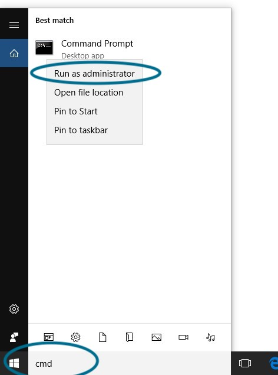

1. Run Command Prompt as administrator (open Start menu, type "cmd.exe", right-click on "Command Prompt" or "Eingabeaufforderung" and choose "Run as administrator"):\
   \
   <br><br>
2. Copy the following text (be sure you select all of it, it's very long) and right-click to paste it in the cmd.exe. This will install Chocolatey, a package manager which will allow us to install and uninstall programs from the command line.
   ```sh
   @"%SystemRoot%\System32\WindowsPowerShell\v1.0\powershell.exe" -NoProfile -InputFormat None -ExecutionPolicy Bypass -Command "iex ((New-Object System.Net.WebClient).DownloadString('https://chocolatey.org/install.ps1'))" && SET "PATH=%PATH%;%ALLUSERSPROFILE%\chocolatey\bin"
   ```
