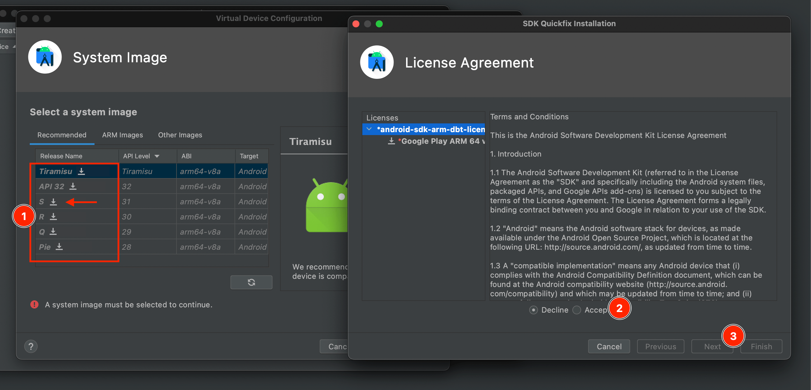

Before starting the setup, check that your hardware, operating system and account is compatible:

### Minimum RAM: 8GB

Make sure that your machine has at least 8GB RAM

### Minimum OS Version: Windows 10

Make sure that you're running Windows 10 or later - earlier versions such as Windows 7 or 8.1 are not supported

### Spaces in Windows User Name

Open the Start menu and type "cmd" and click on "Command Prompt". When PowerShell starts, type in `echo %USERPROFILE%`. It should display something like `C:\Users\Karl` (without any spaces).

If you see spaces in the path (eg. `C:\Users\Karl Horky`) then you should create a new Windows account:

- Start menu -> Settings -> Accounts -> Family & other users -> Add other user -> Add account
- Enter a name **without spaces** in the user name (the box beneath the question "Who's going to use this PC?")
- Once you create the new account, log in to the new account and try the command above again

Make sure to use an account without spaces in the user name for the course.

---

With those compatibility things out of the way, you're ready to start the system setup:

1. Open the Start menu, type "Windows Update" and click on the result named Windows Update. Make sure that you have all of the latest updates.
2. Open the Start menu and type "powershell". Right-click on the item "Windows PowerShell" that appears and choose "Run as administrator":<br>
   <br>
   
   <br>This will run Powershell as an administrator user<br><br>
3. Copy the following text (be sure you select all of it, it's very long) and right-click in the blue middle part of the PowerShell window to paste the text. Hit enter.<br><br>
   ```bash
   Set-ExecutionPolicy Bypass -Scope Process -Force; [System.Net.ServicePointManager]::SecurityProtocol = [System.Net.ServicePointManager]::SecurityProtocol -bor 3072; iex ((New-Object System.Net.WebClient).DownloadString('https://chocolatey.org/install.ps1'))
   ```
   This will install Chocolatey, a package manager which will allow us to install and uninstall programs from the command line.
   <br>
4. The installer will take a bit of time and then show a message that "Chocolatey is ready", signaling that it is done:<br><br>
   <br><br>
5. Close PowerShell and open it again as administrator (like in step 2)<br><br>
6. Copy the following text and right-click in the blue middle part of the PowerShell window to paste the text. Hit enter.<br><br>
   ```bash
   choco install git nodejs-lts vscode hyper httpie flyctl -y
   ```
   This uses Chocolatey to install Git, Node.js, Visual Studio Code, Hyper, HTTPie and `flyctl`.<br><br>
   <!--
      **Note:** If you are using Windows 7, you may have encountered a problem with installing Node.js because [the latest versions no longer support Windows 7](https://github.com/nodejs/node/issues/33000). To get around this, run this separately: `choco install nodejs -y --version 13.6.0`<br><br>
   -->
   If you don't have Zoom installed yet, run this to install it:<br>
   ```bash
   choco install zoom -y
   ```
   If you don't have Slack installed yet, run this to install it:<br>
   ```bash
   choco install slack -y
   ```
7. Copy the following text and right-click in the blue middle part of the PowerShell window to paste the text. Hit enter.<br><br>
   ```bash
   corepack enable
   corepack prepare pnpm@latest --activate
   ```
   This uses Corepack to install `pnpm`.<br><br>
8. Close PowerShell and open it again as administrator (like in step 2). Copy each line in the following text, right-click in the blue middle part of the PowerShell window to paste the text and hit enter.

   ```bash
   choco install python visualstudio2017-workload-vctools -y
   npm config set msvs_version 2017
   ```

   This may take some time (possibly up to 15-20 minutes). This uses Chocolatey to install some Windows build tools to help with installing some Node.js native modules.

9. <a name="vs-code-extensions"></a> Copy each line in the following text, right-click in the blue middle part of the PowerShell window to paste the text and hit enter.<br><br>

   ```bash
   code --install-extension bradlc.vscode-tailwindcss
   code --install-extension Cardinal90.multi-cursor-case-preserve
   code --install-extension dbaeumer.vscode-eslint
   code --install-extension dozerg.tsimportsorter
   code --install-extension esbenp.prettier-vscode
   code --install-extension frigus02.vscode-sql-tagged-template-literals-syntax-only
   code --install-extension kumar-harsh.graphql-for-vscode
   code --install-extension meganrogge.template-string-converter
   code --install-extension styled-components.vscode-styled-components
   code --install-extension stylelint.vscode-stylelint
   code --install-extension sysoev.vscode-open-in-github
   code --install-extension mattpocock.ts-error-translator
   code --install-extension unional.vscode-sort-package-json
   code --install-extension viijay-kr.react-ts-css
   code --install-extension vunguyentuan.vscode-css-variables
   code --install-extension wix.glean
   ```

   This installs some VS Code extensions we will need.<br><br>

10. We recommend installing and using Chrome so that you have the same DevTools as others.<br><br>
    If you don't have Chrome installed yet, you can install it with Chocolatey. To do this, copy the following text and right-click in the blue middle part of the PowerShell window to paste the text. Hit enter.<br><br>
    ```bash
    choco install googlechrome -y
    ```
    This uses Chocolatey to install Chrome.<br><br>
11. Install the following Chrome Extensions:
    - [React Developer tools Chrome Extension](https://chrome.google.com/webstore/detail/react-developer-tools/fmkadmapgofadopljbjfkapdkoienihi?hl=en)
    - [Refined GitHub Chrome Extension](https://chrome.google.com/webstore/detail/refined-github/hlepfoohegkhhmjieoechaddaejaokhf?hl=en)
    - [Socket Security Chrome Extension](https://chrome.google.com/webstore/detail/socket-security/jbcobpbfgkhmjfpjjepkcocalmpkiaop?hl=en)
    - [Web Vitals Chrome Extension](https://chrome.google.com/webstore/detail/web-vitals/ahfhijdlegdabablpippeagghigmibma?hl=en)
12. Close PowerShell and open it again as administrator (like in step 2)<br><br>
13. Copy the following text and right-click in the PowerShell window to paste the text. Hit enter.<br><br>

    ```bash
    pnpm create @upleveled/react-app --help
    ```

    This will prepare a program that we will use in the course. This will take a while and then respond with a message with some usage instructions, similar to this:<br><br>
    <br><br>

14. Copy the following text and right-click in the PowerShell window to paste the text. Hit enter.<br><br>
    ```bash
    pnpm add --global @upleveled/preflight
    ```
    This will prepare a program that we will use in the course.<br><br>
15. <a name="vs-code-settings"></a> Next we will configure VS Code.<br><br>
    Open VS Code and then press the keys <kbd>Ctrl</kbd>-<kbd>Shift</kbd>-<kbd>P</kbd>. Type in "Settings" and select the item that says `Preferences: Open User Settings (JSON)`:<br><br>
    <br><br>
    Once the settings file is open, we will want to add the settings below.<br><br>
    First of all, identify whether your settings file is empty or not. This is what an empty file looks like:<br><br>
    <br><br>
    If your file is **not empty** (if there is more text within the curly brackets), then **we will need to do something extra** - add a comma on the second to last line:<br><br>
    <br><br>
    Now in both cases you will want to paste the following settings **before the closing curly bracket (before the `}`)**:<br><br>

    ```json5
    "editor.wordWrap": "on",
    "editor.minimap.enabled": false,
    "editor.linkedEditing": true,
    "editor.tabSize": 2,
    "workbench.editor.tabSizing": "shrink",
    "workbench.editor.closeEmptyGroups": false,
    "workbench.tree.enableStickyScroll": true,
    "terminal.integrated.stickyScroll.enabled": true,
    "terminal.integrated.defaultProfile.windows": "Git Bash",
    "files.insertFinalNewline": true,
    "files.trimFinalNewlines": true,
    "files.trimTrailingWhitespace": true,
    "[markdown]": {
      "files.trimTrailingWhitespace": false
    },
    "files.autoSave": "onFocusChange",
    "editor.formatOnSave": true,
    "editor.codeActionsOnSave": [
      // Sort package.json keys with https://marketplace.visualstudio.com/items?itemName=unional.vscode-sort-package-json
      "source.sortPackageJson"
    ],
    "tsImportSorter.configuration.groupRules": ["^node:", {}, "^[.]"],
    "tsImportSorter.configuration.keepUnused": [".*"],
    "tsImportSorter.configuration.emptyLinesBetweenGroups": 0,
    "tsImportSorter.configuration.wrappingStyle": "prettier",
    "editor.defaultFormatter": "esbenp.prettier-vscode",
    "[html]": {
      "editor.defaultFormatter": "esbenp.prettier-vscode"
    },
    "[javascript]": {
      "editor.defaultFormatter": "esbenp.prettier-vscode"
    },
    "[javascriptreact]": {
      "editor.defaultFormatter": "esbenp.prettier-vscode"
    },
    "[typescript]": {
      "editor.defaultFormatter": "esbenp.prettier-vscode"
    },
    "[typescriptreact]": {
      "editor.defaultFormatter": "esbenp.prettier-vscode"
    },
    "[json]": {
      "editor.defaultFormatter": "esbenp.prettier-vscode"
    },
    "[jsonc]": {
      "editor.defaultFormatter": "esbenp.prettier-vscode"
    },
    "prettier.singleQuote": true,
    "prettier.trailingComma": "all",
    "eslint.runtime": "node",
    "eslint.experimental.useFlatConfig": true,
    ```

    After you have pasted the settings, save the file with `File` -> `Save` in the top menu.<br><br>
    If you had any previous settings beforehand, you may notice that some text above will be underlined by a squiggly yellow line. This is a warning because we pasted some duplicate properties from the code above.<br><br>
    If you have any of these warnings, we should fix them. For each one of these lines with the warnings on them, delete the full line, including the comma at the end. We usually like to select from the start of the first `"` to just before the next `"` on the next line:<br><br>
    <br><br>
    If you made any further changes to the file, save the file again with `File` -> `Save` in the top menu.<br><br>

16. To verify that the VS Code configuration was successful, select `Terminal` -> `New Terminal` in the top menu:<br><br>
    <br><br>

    Once the terminal appears, copy the following text, paste it into the terminal and hit return:

    ```bash
    echo -e "VS Code Config:\n  Shell: $SHELL\n  Terminal: $TERM"
    ```

    This should display the following output on Windows:

    ```bash
    VS Code Config:
      Shell: /usr/bin/bash
      Terminal: xterm-256color
    ```

    Check line 2 and 3 of the output on your screen carefully against the output above. If your output isn't exactly the same, return to the previous step and re-check if everything was completed fully.

17. Now we will configure Hyper.<br><br>
    Open Hyper and then select Edit -> Preferences, which will open a text file in an editor:<br><br>
    <br><br>
    In this file, we will do three things:

    1. Find `shell: '',` and replace it with `shell: 'C:\\Program Files\\Git\\bin\\bash.exe',`
    2. Find `env: {},` and replace it with `env: { TERM: 'cygwin' },`

    Then save the file and close and restart Hyper.

18. To verify that the Hyper configuration was successful, copy the following text, paste it into Hyper and hit return:

    ```bash
    echo -e "Hyper Config:\n  Shell: $SHELL\n  Terminal: $TERM"
    ```

    This should display the following output:

    ```bash
    Hyper Config:
      Shell: C:\Program Files\Git\bin\bash.exe
      Terminal: cygwin
    ```

    Check line 2 and 3 of the output on your screen carefully against the output above. If your output isn't exactly the same, return to the previous step and re-check if everything was completed fully.

19. <a name="postgresql"></a>We will now install PostgreSQL. Search for Hyper in the start menu, then right click on it and choose "Run as Administrator".

    Copy the following text, paste it in Hyper and hit return.

    ```bash
    choco install postgresql16 --params '/Password:postgres'
    ```

    This will install PostgreSQL and create a default user of `postgres` and a password of `postgres`. Remember this password and use it any time it asks from now on.

    After the installation is complete, close Hyper and reopen it (just as a normal user - not as an administrator).

    Now let's set an environment variable to tell PostgreSQL where to find the programs and where to put the data. Copy and run each of these lines separately in Hyper:

    ```bash
    echo "export PATH=\$PATH:\"/c/Program Files/PostgreSQL/16/bin\"" >> "$USERPROFILE/.bash_profile"
    echo "export PGDATA=\"/c/Program Files/PostgreSQL/16/data\"" >> "$USERPROFILE/.bash_profile"
    source "$USERPROFILE/.bash_profile"
    ```

    <!--

    You may encounter some "Permission denied" warnings during some of these steps, which should be no problem:

    <br><br>

    Test whether the previous command worked by running the following command:

    ```bash
    cat "$USERPROFILE/.bash_profile"
    ```

    It should print out something that looks like the following (although the `16` number may be different for you):

    ```bash
    export PATH=$PATH:"/c/Program Files/PostgreSQL/16/bin"
    export PGDATA="/c/Program Files/PostgreSQL/16/data"
    ```

    -->

    We can now test whether PostgreSQL has been correctly installed by starting the database. To do this, we can run the following command:

    ```bash
    postgres
    ```

    If it worked, it should print out some lines with some messages and end with the rectangular cursor on the left side of the screen:

    <br><br>

    The messages may be different than the messages in the image above, and may not mention that PostgreSQL is ready to accept connections:

    <br><br>

    You will need to run this every time you want to use your database.

    When you want to stop PostgreSQL again, just stop it like any other command line program using the shortcut <kbd>control</kbd>-<kbd>C</kbd>.

    Now we will connect to PostgreSQL using a tool called `psql` and add a new table, to make sure everything is working with the connection.

    Open a new tab in Hyper using <kbd>control</kbd>-<kbd>shift</kbd>-<kbd>T</kbd> and run the following command:

    ```bash
    psql -U postgres
    ```

    It will ask you for a password - enter `postgres` (the password will not be visible). Now it should look like this:<br><br>

    <br><br>

    If your screen looks like the above screenshot, type in or copy and paste the following query (this is a language called SQL):

    ```sql
    CREATE TABLE users(
      id serial PRIMARY KEY,
      first_name VARCHAR (100) NOT NULL,
      last_name VARCHAR (100) NOT NULL
    );
    ```

    It should print `CREATE TABLE` on the line after running the query. Your screen should look like this:<br><br>

    <br><br>

    Now let's check that the table has been created. Run this query:

    ```
    \dt
    ```

    This will show the tables that you have, including the newly-created `users` table. Your screen should look like this (although the owner may be `postgres` on your screen):<br><br>

    <br><br>

    Finally, let's delete the table again to clean up. Run this query:

    ```sql
    DROP TABLE users;
    ```

    It should print `DROP TABLE` on the line after running the query. Your screen should look like this:<br><br>

    <br><br>

    Great, PostgreSQL is set up! 🚀 Now you can exit from `psql` again by writing `exit` and hitting return:

    ```
    exit
    ```

    It should exit and send you back to the command line. Your screen should look similar to this (the last line will not be exactly the same):<br><br>

    <br><br>

    Now close the new tab in Hyper with <kbd>control</kbd>-<kbd>W</kbd>, and stop PostgreSQL again using <kbd>control</kbd>-<kbd>C</kbd>. PostgreSQL should shut down - your screen should look similar to this (the last line will not be exactly the same):<br><br>

    <br><br>

20. <a name="docker"></a>We will now install Docker.

    **Option A - Windows 10/11 Pro:**

    1. Search for Hyper in the start menu, then right click on it and choose "Run as Administrator".
    2. Copy the following text and paste it into Hyper. Hit enter.

    ```bash
    choco install wsl2 -y
    choco install wsl-ubuntu-2004 -y
    choco install docker-desktop -y
    ```

    3. Open start menu and search for "Docker Desktop". Run it. This will set up and start Docker.<br><br>
       You will need to run this every time you want to work with Docker after you restart.

    **Option B - Windows 10/11 Home:**

    1. **Windows 10 only:** Click on the start menu, type in "winver" to the search and verify you have at least Windows 10 version 1903. If your number is lower than 1903, run Windows Update.<br><br>
       <br><br>
    2. Search for Hyper in the start menu, then right click on it and choose "Run as Administrator".
    3. Copy the following text and paste it into Hyper. Hit enter.

    ```bash
    choco install wsl2 -y
    choco install wsl-ubuntu-2004 -y
    choco install docker-desktop -y
    ```

    4. Open the start menu and search for "Ubuntu". Start it - it should ask you to create a user with a password. This will be your user to log in to your Ubuntu Linux Subsystem - note down the username and password somewhere secure to make sure you do not forget it.
    5. Open the start menu and search for "Docker Desktop". Start it and go to the Settings. Under the General tab, you will find an option called "Use WSL 2 based engine". Make sure this is checked.

21. Test if Docker is installed by running the following command on the command line:

    ```bash
    docker run hello-world
    ```

    It should print out a welcome message like this:<br><br>
    <br><br>

22. <a name="expo-react-native"></a>We will now install Expo CLI for React Native. Search for Hyper in the start menu, then right click on it and choose "Run as Administrator".

    Copy the following text, paste it in Hyper and hit return.

    ```bash
    npm install -g expo-cli
    ```

    You can ignore the lines marked `WARN` - these do not indicate problems:<br><br>

    <br><br>

    Lastly, we'll install Expo on your phone, so that you can also test on a real device.

    On your phone, go to the app store and install Expo on your phone ([Android](https://play.google.com/store/apps/details?id=host.exp.exponent&hl=en&gl=US), [iOS](https://apps.apple.com/us/app/expo-go/id982107779)). Create an account and log in.

23. Next we will set up some dependencies for Expo and React Native.

    Copy each line in the following text, paste it in Hyper and hit return.

    ```bash
    choco install androidstudio
    echo "export PATH=$HOME/AppData/Local/Android/Sdk/platform-tools:\$PATH" >> ~/.bash_profile
    source ~/.bash_profile
    ```

    This will install Android Studio, for creating and running Android virtual devices in an emulator.

    Open Android Studio by finding it using the Start menu.

    If it asks to import Android Studio Settings, choose **Do not import settings**.

    When prompted, choose a **Custom** install:<br><br>

    <br><br>

    Leave the default JDK installation location as-is and click **Next**:<br><br>

    <br><br>

    Uncheck the box next to **Android Virtual Device** (we will install our own manually):<br><br>

    <br><br>

    For each of the licenses with red stars next to them, click on the license name and then accept the agreement, finally clicking on **Finish** when you have accepted all agreements:<br><br>

    <br><br>

    This will download components, which may take a few minutes:<br><br>

    <br><br>

    Next will be getting a virtual device installed. Click on **More Actions** and select **Virtual Device Manager**:<br><br>

    <br><br>

    Click on the **Create device** button on the top left of the window:<br><br>

    <br><br>

    Select the Pixel 3a as the hardware device.

    Under the **Recommended** tab (the default tab), locate the system image named **R** (API level 30) and click on the **Download** link next to it. In the window that pops up, accept the license agreement and click **Next**:<br><br>

    <br><br>

    Once the download completes, select the image you just downloaded and click on **Next** through the rest of the steps until the virtual device has been created:<br><br>

    <br><br>

    The device will now show up in the Device Manager. Click on the triangular play button to launch the virtual device in the emulator. An emulator window will appear showing the screen of the virtual device:<br><br>

    <br><br>

    If a message pops up in the virtual device that the "System UI isn't responding" at any point during these steps, you can click on "Wait".

    Before running the first Expo app, test that the Android Studio `adb` (Android Debug Bridge) program has been set up properly, by running the following in a new Hyper command line (open a new tab):

    ```bash
    adb
    ```

    It should print the version and help information:<br><br>

    <br><br>

24. To verify that Expo is working with the Android Studio virtual device copy and run each of these lines separately in Hyper:

    <!-- TODO: Check if we can remove the `echo ...` and `pnpm install ...` steps below when Expo supports RN 0.72 with symlinks https://github.com/upleveled/system-setup/issues/28 -->

    ```bash
    cd ~
    mkdir -p projects
    cd projects
    pnpm create expo@latest expo-test --template blank
    cd expo-test
    echo 'node-linker=hoisted' > ./.npmrc
    pnpm install --force
    pnpm start --android
    ```

    This will create a new Expo demo app and start it.

    If this step doesn't work, it's possible that you may not have the emulator running - check the last part of the previous step to see how to launch the emulator.

    The first thing that you will see is the installation of Expo Go on the virtual device:<br><br>

    <br><br>

    Next, the Metro bundler will bundle the JavaScript for the device, which may take some time. You will see a loading bar in the command line and a loading screen on the virtual device:<br><br>

    <br><br>

    <br><br>

    After the bundling has completed, the simple app should show up in the virtual device, with the words "Open up App.js to start working on your app!" (if it instead says "Universal React with Expo", this is also ok):<br><br>

    <br><br>

    Click on the small `x` at the top right of the virtual device frame to stop the virtual device - this will save a snapshot to make starting the virtual device faster in the future.

25. If you don't have one yet, create a Google account [here](https://accounts.google.com/signup?hl=en). Make a note of the email address associated with this account for usage in later steps.
26. If you don't have one yet, create a GitHub account [here](https://github.com/join). Make sure to set a name.

    If you already have a GitHub account and you haven't set a name on GitHub yet, go to the [GitHub Profile Settings](https://github.com/settings/profile) and add a name:<br><br>
    <br><br>
    We will use this name in the next step.<br><br>

27. For this step, we'll need to **edit some of the information in the commands** by adding our own information.<br><br>
    First of all, we will set our name, which will be the same name as on our GitHub profile:<br><br>
    <br><br>
    Copy your name from your profile, **add it in quotes** in the command (replace `Mona Lisa Octocat`) and run the command:<br><br>
    ```bash
    git config --global user.name "Mona Lisa Octocat"
    ```
    You can test whether the name was set correctly with the next command (if it worked, it will print the name on the next line):<br><br>
    ```bash
    git config --global user.name
    ```
    <br>For running the next command, **add your email in quotes**:<br><br>
    ```bash
    git config --global user.email "monalisaoctocat@example.com"
    ```
    You can test whether the email was set correctly with with the next command (if it worked, it will print the email on the next line):<br><br>
    ```bash
    git config --global user.email
    ```
    This prepares `git` so that your work is attributed correctly to you.<br><br>

<!-- 25. Copy the following text, paste it in the terminal and hit return.<br><br>
    ```bash
    git config --global credential.helper wincred
    ```
    This step will save your GitHub password so that you don't need to enter it every time.<br><br> -->

25. Copy the following text, paste it in Hyper and hit return.<br><br>
    ```bash
    git config --global init.defaultBranch main
    ```
    This step will change the default Git branch from `master` to `main` (see https://github.com/github/renaming).<br><br>
26. Copy and run each of these lines separately in Hyper.<br><br>
    ```bash
    git config --global core.autocrlf false
    git config --global core.eol lf
    ```
    This step will improve line breaks compatibility on Windows.
27. Go back to GitHub, and go to your profile page by clicking on your avatar at the top right and selecting **Your profile**<br><br>
    <br><br>
    Copy the `github.com/...` URL in the address bar of your browser, for use in the next step.
28. Open the Start menu and start Slack. Log in to the UpLeveled Slack. Send your GitHub profile URL to [Kimberley](https://upleveled.slack.com/team/U02NSD2E3P1). Also send your Google Account email address to Kimberley (if you haven't already).
29. <a name="specs"></a>Open the start menu, type "Settings" and open the app (or click on the cog on the left). Select "System" and "About". Under "Device specifications", click the Copy button and paste this to Kimberley. Under "Windows specifications", click the Copy button and paste this to Kimberley.
30. On your phone, go to the app store and install Slack on your phone. Log in to the UpLeveled Slack.

## Optional Software

1. If you would like to check the spelling of all code you write in VS Code, try out [Code Spell Checker](https://marketplace.visualstudio.com/items?itemName=streetsidesoftware.code-spell-checker). You can install on the command line with this command:

   ```bash
   code --install-extension streetsidesoftware.code-spell-checker
   ```

2. If you need to record mp4 videos of your screen with sound, try out [Loom](https://www.loom.com/).

   An alternative without the limitations of Loom is Screen to Gif (however, it does not record audio):

   ```bash
   choco install screentogif
   ```

3. If you need a clipboard manager to keep a history of things that you have copied, this is an awesome option:

   ```bash
   choco install ditto
   ```

4. To simultaneously test your web design in multiple mobile viewports, try Responsively App:

   ```bash
   choco install responsively
   ```

5. To remove secrets, large files or other undesirable files from your Git repository, try BFG Repo-Cleaner:

   ```bash
   choco install bfg-repo-cleaner
   ```

6. If you're running out of space on your computer, you can use WinDirStat to analyze your hard drive and show a chart of which items are taking up how much space:

   ```bash
   choco install windirstat
   ```

7. To add [an assortment of new features](https://www.fourth-wall.co.uk/post/powertoys-11-awesome-features-microsoft-won-t-add-to-windows) to Windows such as "pinning" a window to stay on top of all others, quickly renaming or resizing multiple files, splitting your running apps into regions of the screen and more, try Microsoft PowerToys:

   ```bash
   choco install powertoys
   ```
